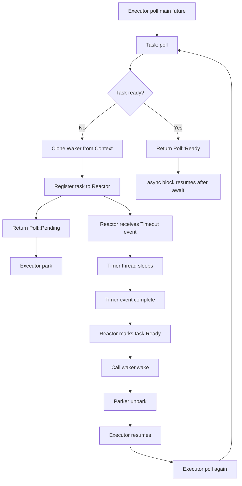

## **Futures Explained in 200 Lines of Rust：执行流动态跟踪分析**

### **实验目标**

本实验针对《Futures Explained in 200 Lines of Rust》中的极简 Future executor 进行动态跟踪，目的是观察一个现代 Rust Future 从首次被 `poll`、注册到 reactor、返回 `Poll::Pending`、Executor 挂起、外部事件完成、`Waker` 唤醒 Executor、再次 `poll`，直到最终返回 `Poll::Ready` 的完整执行流状态变迁过程。

与前一个《A stack-less Rust coroutine library under 100 LoC》示例不同，本示例不再依靠 Executor 对 `Pending` 任务进行无条件反复轮询，而是引入了更接近现代 Rust async runtime 的关键结构：

- Executor 负责调用 `Future::poll`；
- `Task` 作为 leaf future，表示一个异步事件；
- Reactor 负责模拟外部事件源；
- `Waker` 用于从 Reactor 通知 Executor；
- `Parker` 用于挂起和恢复 Executor 所在线程。

因此，本实验重点观察的是：

```text
poll -> register waker -> Pending -> park -> reactor event -> wake -> unpark -> poll again -> Ready
```

这一完整闭环。

### **跟踪点设计**

本次动态跟踪主要覆盖五个层级。

第一类是 Executor 层，用于观察 `block_on` 的执行过程，包括创建 `Parker`、创建 `Waker`、创建 `Context`、调用 `poll`、收到 `Pending` 后进入 `park`，以及被唤醒后再次 `poll`。

第二类是 `Task::poll` 层，用于观察单个 leaf future 的状态变化。重点跟踪任务是否已经在 Reactor 中注册、是否已经 ready、何时返回 `Poll::Pending`、何时返回 `Poll::Ready`。

第三类是 Reactor 层，用于观察任务如何注册到 Reactor，Reactor 线程如何接收 timeout 事件，timer 线程如何模拟外部等待，以及事件完成后如何调用 `wake`。

第四类是 `Waker` 和 `Parker` 层，用于观察 `waker.wake()` 如何最终转换成 `parker.unpark()`，并通过条件变量唤醒 Executor 线程。

第五类是用户 `async block` 层，用于观察 `fut1`、`fut2` 和 `mainfut` 的执行顺序，特别是顺序 `await` 对任务注册时机的影响。

### **程序启动与运行时初始化**

程序开始后，首先进入 `main`，随后创建 Reactor：

```text
[0000] main: enter
[0001] Reactor::new: enter
[0002] Reactor::new: complete, returning Arc
```

这说明 Reactor 在 `block_on` 之前已经完成初始化。随后 Executor 开始运行：

```text
[0003] executor: block_on begin
[0004] executor: created Parker
[0005] executor: created MyWaker
[0006] mywaker_into_waker: called, creating RawWaker
[0007] executor: created Waker from MyWaker
[0008] executor: created Context from Waker
[0009] executor: about to poll future
```

这段日志展示了一个最小 executor 在第一次 `poll` 前的准备工作。Executor 创建了用于线程挂起和唤醒的 `Parker`，再将其封装进 `MyWaker`，并通过 `RawWaker` 构造标准库所需的 `Waker`。随后 `Waker` 被放入 `Context` 中，传递给 `Future::poll`。

这正是现代 Rust Future 接口的核心形式：

```rust
fn poll(self: Pin<&mut Self>, cx: &mut Context<'_>) -> Poll<Self::Output>
```

Executor 不直接知道任务等待的外部事件是什么，它只负责提供一个 `Context`，使 Future 可以在需要等待时保存其中的 `Waker`。

### **第一次 poll：task-1 注册到 Reactor 并返回 Pending**

第一次 `poll` 后，`mainfut` 开始执行：

```text
[0010] mainfut: begin
[0011] mainfut: await fut1
[0012] fut1: begin
[0013] task-1: poll enter
```

这里说明 `Future` 仍然是惰性执行的。`mainfut` 只有在 Executor 调用 `poll` 后才真正开始运行。`mainfut` 首先执行到：

```rust
fut1.await;
```

于是进入 `fut1`，并进一步轮询 `task-1`。

随后 `task-1` 发现自己尚未完成，也尚未注册到 Reactor：

```text
[0014] task-1: first registration to reactor, duration=1s
[0015] mywaker_clone: called
[0016] reactor: register task-1 duration=1s
[0017] reactor: sending Timeout event duration=1s id=1
[0018] task-1: returning Poll::Pending
```

这段日志是该实验的第一个关键点。

`task-1` 第一次被 `poll` 时，并不会立即返回结果，而是将自己注册到 Reactor。注册过程中，它会克隆当前 `Context` 中的 `Waker`，并把这个 `Waker` 存入 Reactor 的任务状态中。随后，Reactor 收到一个 timeout 事件，表示 task-1 需要等待 1 秒。

完成注册后，`task-1` 返回：

```rust
Poll::Pending
```

这表示 task-1 当前无法继续执行，需要等待外部事件完成。

### **Executor 收到 Pending 后挂起**

当 `task-1` 返回 `Pending` 后，Executor 不会继续忙等，而是进入 `park`：

```text
[0019] executor: poll returned Pending, preparing to park
[0020] Parker::park: enter
[0021] Parker::park: waiting on condvar, resumable=false
```

这和前一个 stackless coroutine 示例形成了明显区别。

在 100 行 stackless coroutine 示例中，Executor 收到 `Pending` 后会把任务重新放回队尾，然后继续轮询其他任务。该机制本质上是一种轮转式协作调度。

而在当前示例中，Executor 收到 `Pending` 后会挂起当前线程，等待外部事件通过 `Waker` 唤醒自己。这更加接近现代 Rust async runtime 的基本机制。

此时 Executor 所在线程进入等待状态，直到 `Parker::unpark` 被调用。

### **Reactor 处理事件并唤醒 task-1**

与此同时，Reactor 线程接收到 task-1 的 timeout 事件：

```text
[0022] reactor-thread: start
[0023] reactor-thread: receive Timeout event duration=1s id=1
[0024] timer-thread-1: start, sleeping for 1s
[0025] timer-thread-1: sleep end
```

Reactor 为这个 timeout 事件启动了一个 timer 线程，用 `sleep` 模拟外部异步事件。1 秒后，timer 线程结束睡眠，并调用 Reactor 的 `wake(1)`：

```text
[0026] reactor: wake(1) called
[0027] reactor: task-1 state NotReady -> Ready
[0028] reactor: calling waker.wake() for task-1
```

这段日志展示了 leaf future 从"未就绪"到"就绪"的关键状态变化：

```text
NotReady(Waker) -> Ready
```

在 `Task::poll` 第一次注册时，Reactor 保存的是 `TaskState::NotReady(waker)`。当 timer 事件完成后，Reactor 将 task-1 的状态更新为 `Ready`，并调用之前保存的 `waker.wake()`。

这一步体现了 Rust async 中 `Waker` 的作用：Future 返回 `Pending` 后不会自己继续运行，而是把恢复执行的通知能力交给外部事件源。事件源在条件满足时调用 `wake`，让 Executor 知道这个 Future 可以再次被 `poll`。

### **Waker 唤醒 Executor**

Reactor 调用 `waker.wake()` 后，进入自定义的 `mywaker_wake`：

```text
[0029] mywaker_wake: called
[0030] Parker::unpark: enter
[0031] Parker::unpark: calling notify_one
```

`mywaker_wake` 内部调用 `Parker::unpark`。`Parker::unpark` 修改条件变量对应的状态，并调用 `notify_one` 唤醒正在 `park` 中等待的 Executor 线程。

随后 Executor 线程从条件变量等待中恢复：

```text
[0032] Parker::park: woke up, resumable=true
[0033] executor: resumed from park
```

因此，这个示例中完整的唤醒路径是：

```text
timer-thread
  -> reactor.wake(task_id)
  -> TaskState::NotReady -> Ready
  -> waker.wake()
  -> mywaker_wake()
  -> parker.unpark()
  -> condvar.notify_one()
  -> executor resumes from park
```

这就是现代 Rust async runtime 中 "事件完成后唤醒 executor" 的最小化演示。

### **第二次 poll：task-1 返回 Ready**

Executor 被唤醒后，会再次轮询 `mainfut`：

```text
[0034] executor: about to poll future
[0035] task-1: poll enter
[0036] task-1: reactor.is_ready(1) == true
[0037] task-1: state marked as Finished
```

这次 `task-1` 被 `poll` 时，Reactor 中对应的任务状态已经被标记为 `Ready`。因此 `task-1` 不再注册事件，也不再返回 `Pending`，而是将状态标记为 `Finished` 并返回结果。

随后 `fut1.await` 完成，`fut1` 从 await 后恢复：

```text
[0038] fut1: resumed with value=1
Got 1 at time: 1.00.
```

这说明 `async/await` 状态机保存了执行位置。第一次 `poll` 时，`fut1` 在 `task-1.await` 处挂起；第二次 `poll` 时，`task-1` 返回 `Ready`，于是 `fut1` 从 await 后继续执行。

### **顺序 await 导致 task-2 延迟注册**

`fut1` 完成后，`mainfut` 才继续执行到 `fut2.await`：

```text
[0039] mainfut: await fut2
[0040] fut2: begin
[0041] task-2: poll enter
[0042] task-2: first registration to reactor, duration=2s
[0043] mywaker_clone: called
[0044] reactor: register task-2 duration=2s
[0045] reactor: sending Timeout event duration=2s id=2
[0046] task-2: returning Poll::Pending
```

这是一个很重要的观察结果。

虽然程序中创建了 `future1` 和 `future2`，但 `mainfut` 的结构是顺序等待：

```rust
let mainfut = async {
    fut1.await;
    fut2.await;
};
```

因此，`task-2` 并没有在程序一开始就注册到 Reactor，而是在 `fut1` 完成之后才开始被 `poll` 和注册。

这也解释了最终输出时间：

```text
Got 1 at time: 1.00.
Got 2 at time: 3.01.
```

`task-1` 等待 1 秒，完成后才开始注册 `task-2`。`task-2` 再等待 2 秒，因此总耗时约为 3 秒。如果两个任务是真正并发等待，则总耗时应接近 2 秒，而不是 3 秒。

这说明当前示例中的两个 future 是**顺序执行的 await 链**，而不是并发 join。

### **task-2 的 Pending、wake 与 Ready 流程**

`task-2` 的执行流与 `task-1` 类似。它返回 `Pending` 后，Executor 再次进入 park：

```text
[0047] executor: poll returned Pending, preparing to park
[0048] Parker::park: enter
[0049] Parker::park: waiting on condvar, resumable=false
```

Reactor 线程接收 task-2 的 timeout 事件，并启动 timer 线程：

```text
[0050] reactor-thread: receive Timeout event duration=2s id=2
[0051] timer-thread-2: start, sleeping for 2s
[0052] timer-thread-2: sleep end
```

事件完成后，Reactor 更新状态并调用 waker：

```text
[0053] reactor: wake(2) called
[0054] reactor: task-2 state NotReady -> Ready
[0055] reactor: calling waker.wake() for task-2
[0056] mywaker_wake: called
[0057] Parker::unpark: enter
[0058] Parker::unpark: calling notify_one
```

Executor 被唤醒并再次 poll：

```text
[0059] Parker::park: woke up, resumable=true
[0060] executor: resumed from park
[0061] executor: about to poll future
[0062] task-2: poll enter
[0063] task-2: reactor.is_ready(2) == true
[0064] task-2: state marked as Finished
[0065] fut2: resumed with value=2
Got 2 at time: 3.01.
```

此时 `fut2.await` 完成，`mainfut` 继续执行到末尾：

```text
[0066] mainfut: done
[0067] executor: poll returned Ready
```

Executor 收到整个 `mainfut` 的 `Poll::Ready` 后，`block_on` 结束。

### **Reactor 关闭与资源回收**

主任务完成后，程序关闭 Reactor：

```text
[0068] RawWaker: drop called
[0069] reactor: close called, sending Close event
[0070] main: exit
[0071] Reactor::drop: enter, joining reactor thread
```

Reactor 线程收到关闭事件后，等待 timer 线程结束并退出：

```text
[0072] reactor-thread: receive Close event
[0073] reactor-thread: joining timer threads
[0074] reactor-thread: exit
[0075] Reactor::drop: complete
```

这说明该示例虽然是教学实现，但仍然包含了基本的资源清理路径：主线程发送 Close 事件，Reactor 线程退出前 join 已创建的 timer 线程，最后 `Reactor::drop` 完成。

### **执行流状态机总结**

从单个 `Task` 的角度看，它的状态迁移可以概括为：

```text
Created
  -> FirstPoll
  -> RegisterToReactor
  -> NotReady(Waker)
  -> Pending
  -> ReactorEventComplete
  -> Ready
  -> RePoll
  -> Finished
```


从 Executor 与 Reactor 的交互角度看，完整闭环可以表示为：



### **关键观察结果**

通过本次动态跟踪，可以得到以下结论。

首先，Future 是惰性执行的。`mainfut`、`fut1`、`fut2` 和 `task` 都是在 Executor 调用 `poll` 后才开始执行。

其次，`Task::poll` 第一次执行时，如果外部事件尚未完成，会克隆当前 `Context` 中的 `Waker`，并把任务注册到 Reactor，然后返回 `Poll::Pending`。

第三，Executor 收到 `Poll::Pending` 后并不会继续轮询该任务，而是通过 `Parker::park` 挂起当前线程。这一点区别于前一个 stackless coroutine 示例中的忙轮询式队列轮转。

第四，Reactor 在外部事件完成后，会将任务状态从 `NotReady(Waker)` 修改为 `Ready`，并调用保存的 `waker.wake()`。

第五，`waker.wake()` 最终会调用 `Parker::unpark`，通过条件变量唤醒 Executor 所在线程。

第六，Executor 被唤醒后再次调用 `poll`。此时 `Task::poll` 发现 Reactor 中的任务状态已经是 `Ready`，于是返回 `Poll::Ready`，对应的 `await` 表达式完成，async block 从暂停点继续执行。

第七，`mainfut` 中的 `fut1.await; fut2.await;` 是顺序等待，因此 `task-2` 并没有与 `task-1` 同时注册到 Reactor。日志中的总耗时约为 3 秒，正好对应 `task-1` 的 1 秒等待加上 `task-2` 的 2 秒等待。

### **与 100 行 stackless coroutine 示例的区别**

本实验与前一个 stackless coroutine 动态跟踪结果形成了清晰对比。

| 对比项                   | 100 行 stackless coroutine | 200 行 futures-explained             |
| ------------------------ | -------------------------- | ------------------------------------ |
| `Pending` 后行为         | Executor 将任务重新入队    | Executor 挂起线程                    |
| 是否有有效 `Waker`       | 没有，使用 null waker      | 有，`Waker` 可唤醒 Executor          |
| 是否有 Reactor           | 没有                       | 有                                   |
| 恢复执行的原因           | Executor 主动再次 poll     | Reactor 事件完成后调用 wake          |
| 是否模拟外部事件         | 否                         | 是，用 timer 线程模拟                |
| 更接近现代 async runtime | 否，偏 coroutine 教学      | 是，展示 executor/reactor/waker 闭环 |

因此，《A stack-less Rust coroutine library under 100 LoC》主要展示的是"`async/await` 状态机 + 协作式轮转调度"；而《Futures Explained in 200 Lines of Rust》展示的是"`Future::poll` + `Context/Waker` + Reactor + Executor park/unpark"的现代 Rust 异步运行时核心机制。

### **实验结论**

《Futures Explained in 200 Lines of Rust》的动态跟踪结果表明，现代 Rust Future 的执行并不是由 Future 自己主动运行，也不是由 Executor 无条件反复轮询完成，而是由 Executor、Future、Reactor 和 Waker 共同构成一个事件驱动闭环。

在该闭环中，Executor 首次 `poll` Future；Future 在无法立即完成时，将当前 `Waker` 注册到 Reactor 并返回 `Poll::Pending`；Executor 收到 `Pending` 后挂起当前线程；Reactor 在外部事件完成后调用 `waker.wake()`；`Waker` 唤醒 Executor；Executor 再次 `poll` Future；Future 发现事件已经 ready，于是返回 `Poll::Ready`，async block 从 `.await` 后继续执行。

这说明 `Waker` 是连接 Reactor 和 Executor 的关键桥梁。Reactor 不直接执行 Future，也不直接恢复 async block；它只负责在事件完成后调用 `wake`。真正推动 Future 状态机继续前进的动作仍然是 Executor 后续的 `poll`。

该示例虽然仍是教学性质的简化实现，例如用 timer 线程模拟外部事件，用 Condvar/Parker 挂起执行器线程，但它已经完整呈现了现代 Rust async 的核心状态变迁过程：

```text
Poll -> Pending -> Register Waker -> Park -> Event Ready -> Wake -> Unpark -> Poll Again -> Ready
```

### **关于多线程日志显示顺序**

需要注意的是，在多线程环境下，日志的显示顺序可能与事件编号不完全一致。这是因为：

1. 不同线程可能几乎同时获取事件编号
2. 实际写入 stdout 的时机可能存在交错
3. AtomicUsize 的递增和日志写入不在同一个互斥区间

例如，观察 `[0022] reactor-thread: start` 的位置：
- 该事件编号为 0022，说明 reactor 线程较早获取了这个编号
- 但在实际输出中，它出现在某些主线程日志之后
- 这是正常的多线程日志现象，不影响执行流的正确性

在分析时，应以事件编号和逻辑因果链为准，而不是仅依赖终端显示的物理顺序。如果需要严格按编号顺序输出日志，可以将事件编号分配、格式化和 stdout 输出都放入同一个 `Mutex` 临界区。

### **关键发现总结**

**1. 它不是忙轮询，而是事件唤醒**

关键证据：

```text
[0019] executor: poll returned Pending, preparing to park
[0021] Parker::park: waiting on condvar, resumable=false
...
[0028] reactor: calling waker.wake() for task-1
[0030] Parker::unpark: enter
[0032] Parker::park: woke up, resumable=true
```

这说明 Executor 在 `Pending` 后确实睡眠等待，而不是像 100 行 coroutine 那样持续轮询。

**2. `fut1.await; fut2.await;` 是顺序执行，不是并发执行**

关键证据：

```text
[0038] fut1: resumed with value=1
Got 1 at time: 1.00.
[0039] mainfut: await fut2
[0040] fut2: begin
[0041] task-2: poll enter
```

`task-2` 是在 `fut1` 完成之后才被 poll 和注册的，所以总时间是：

```text
1s + 2s = 3s
```

这可以作为理解 `join!`、`spawn`、并发 Future 的重要铺垫。

---

**附录：完整运行日志**

```
[0000] main: enter
[0001] Reactor::new: enter
[0002] Reactor::new: complete, returning Arc
[0003] executor: block_on begin
[0004] executor: created Parker
[0005] executor: created MyWaker
[0006] mywaker_into_waker: called, creating RawWaker
[0007] executor: created Waker from MyWaker
[0008] executor: created Context from Waker
[0009] executor: about to poll future
[0010] mainfut: begin
[0011] mainfut: await fut1
[0012] fut1: begin
[0013] task-1: poll enter
[0014] task-1: first registration to reactor, duration=1s
[0015] mywaker_clone: called
[0016] reactor: register task-1 duration=1s
[0017] reactor: sending Timeout event duration=1s id=1
[0018] task-1: returning Poll::Pending
[0019] executor: poll returned Pending, preparing to park
[0020] Parker::park: enter
[0021] Parker::park: waiting on condvar, resumable=false
[0022] reactor-thread: start
[0023] reactor-thread: receive Timeout event duration=1s id=1
[0024] timer-thread-1: start, sleeping for 1s
[0025] timer-thread-1: sleep end
[0026] reactor: wake(1) called
[0027] reactor: task-1 state NotReady -> Ready
[0028] reactor: calling waker.wake() for task-1
[0029] mywaker_wake: called
[0030] Parker::unpark: enter
[0031] Parker::unpark: calling notify_one
[0032] Parker::park: woke up, resumable=true
[0033] executor: resumed from park
[0034] executor: about to poll future
[0035] task-1: poll enter
[0036] task-1: reactor.is_ready(1) == true
[0037] task-1: state marked as Finished
[0038] fut1: resumed with value=1
Got 1 at time: 1.00.
[0039] mainfut: await fut2
[0040] fut2: begin
[0041] task-2: poll enter
[0042] task-2: first registration to reactor, duration=2s
[0043] mywaker_clone: called
[0044] reactor: register task-2 duration=2s
[0045] reactor: sending Timeout event duration=2s id=2
[0046] task-2: returning Poll::Pending
[0047] executor: poll returned Pending, preparing to park
[0020] Parker::park: enter
[0048] Parker::park: waiting on condvar, resumable=false
[0050] reactor-thread: receive Timeout event duration=2s id=2
[0051] timer-thread-2: start, sleeping for 2s
[0052] timer-thread-2: sleep end
[0053] reactor: wake(2) called
[0054] reactor: task-2 state NotReady -> Ready
[0055] reactor: calling waker.wake() for task-2
[0056] mywaker_wake: called
[0057] Parker::unpark: enter
[0058] Parker::unpark: calling notify_one
[0059] Parker::park: woke up, resumable=true
[0060] executor: resumed from park
[0061] executor: about to poll future
[0062] task-2: poll enter
[0063] task-2: reactor.is_ready(2) == true
[0064] task-2: state marked as Finished
[0065] fut2: resumed with value=2
Got 2 at time: 3.01.
[0066] mainfut: done
[0067] executor: poll returned Ready
[0068] RawWaker: drop called
[0069] reactor: close called, sending Close event
[0070] main: exit
[0071] Reactor::drop: enter, joining reactor thread
[0072] reactor-thread: receive Close event
[0073] reactor-thread: joining timer threads
[0074] reactor-thread: exit
[0075] Reactor::drop: complete
```

