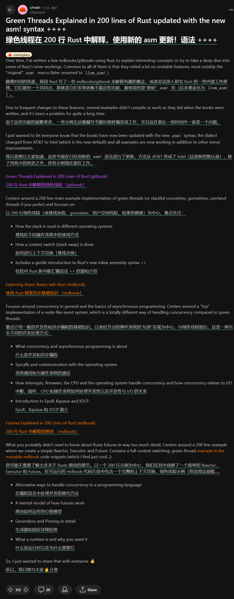

# Green threads in Rust

## 背景

由于原作者 cfsamson 写这些代码的时候依赖当时不稳定的 Rust 功能（比如
`asm!`、`#[naked]`），这些功能已经随着时间而发生了巨大的变化。

这导致回看当时一些文章翻译提供的代码是过时的
* [stevenbai: 200行代码讲透RUST FUTURES](https://stevenbai.top/rust/futures_explained_in_200_lines_of_rust/)
* [耿腾: 两百行Rust代码解析绿色线程原理（五）附录：支持 Windows](https://zhuanlan.zhihu.com/p/101168659)

而原文链接已经逐渐消失在网上（由原作者自己删除[^1]），不过幸运的是，这些原文内容还留有存档
* [Futures Explained in 200 Lines of Rust](https://web.archive.org/web/20230203001355/https://cfsamson.github.io/books-futures-explained/introduction.html)
* [Green Threads Explained in 200 Lines of Rust](https://web.archive.org/web/20220527113808/https://cfsamson.gitbook.io/green-threads-explained-in-200-lines-of-rust/supporting-windows)

[^1]: cfsamson 在几个月前正式发布了他的新书
《[Asynchronous Programming in Rust: Learn asynchronous programming by building working examples of futures, green threads, and runtimes][cfsamson-book]》（[原帖]），
将他以往的异步系列书整合到了一起，有条件的小伙伴可以支持他。

值得注意的是，两百行讲解绿色线程的代码其实在两年前就由原作者本人更新了一次（[帖子][post-update]），上面的存档记录了当时更新过的代码版本，它们是直接可以被运行了。

<details>

<summary>点击展开/收起原作者更新贴的截图</summary>



</details>

[cfsamson-book]: https://www.amazon.com/Asynchronous-Programming-Rust-asynchronous-programming/dp/1805128132
[原帖]: https://www.reddit.com/r/rust/comments/1amlro1/new_rust_book_asynchronous_programming_in_rust_is/
[post-update]: https://www.reddit.com/r/rust/comments/seb0ex/green_threads_explained_in_200_lines_of_rust/

## 代码仓库

cfsamson 的代码仓库自然也被他自己删除了，所以这个仓库记录的代码主要是由我搜集和改动的。

### `cargo run`

green-thread 位于 `src/main.rs`，是参照更新过的源码，我稍微改动了一下：
* 将不同目标平台的条件编译代码拆分到模块：运行 `cargo run` 会根据 host OS 运行相应的代码
* 修复 clippy 的建议
* 目前在 x86-64 架构上 Ubuntu 22.04 LTS 和 Windows11 机器上已经测试通过，暂不支持 MacOS
* 由于仍然使用 `#[naked]` 这个夜间功能，你需要 nightly Rust 才能运行它

更新：
* 此代码需要 2024 年 10 月之后的 nightly，因为 naked 函数现在只能使用 `naked_asm!`
* 基于 lewiszlw 的 [博客][lewiszlw-blog] 和 [代码][lewiszlw-code]，现在支持 risc-v 64，你可以使用
  `cargo r --target riscv64gc-unknown-linux-gnu` 运行，已在 ubuntu 机器上测试通过；首次运行需要以下命令

```shell
# install risc-v toolchain
sudo apt install gcc-riscv64-linux-gnu g++-riscv64-linux-gnu libc6-dev-riscv64-cross
# install qemu
sudo apt install qemu-system-riscv64
sudo apt install qemu-user-static
# add target
rustup target add riscv64gc-unknown-linux-gnu
```

[lewiszlw-blog]: https://systemxlabs.github.io/blog/green-threads-in-200-lines-of-rust/
[lewiszlw-code]: https://github.com/systemxlabs/green-threads-in-200-lines-of-rust

### `cargo r --example updated`

full 位于 `examples/updated.rs`，这是原作者更新过的源码，支持 linux 和 windows，green-thread 基于它。

### `cargo r --example linux-only`

linux-only 位于 `examples/linux-only.rs`，是参照未更新的代码（来自中文翻译的 200 行讲 Futures），在训练营第三阶段第一周和“人造人”一起改的。

修复一些错误和警告，并增加了一些日志式的打印，它可以跑在 stable Rust 中，因为 `#[naked]` 被替换成了类似 rCore 那样的纯汇编写法。

它无法在 Windows 上跑通，如果你想解决它，需要阅读我上面给的英文原文，里面介绍了支持 Windows 系统的思路，或者直接研究/运行 green-thread 代码。
