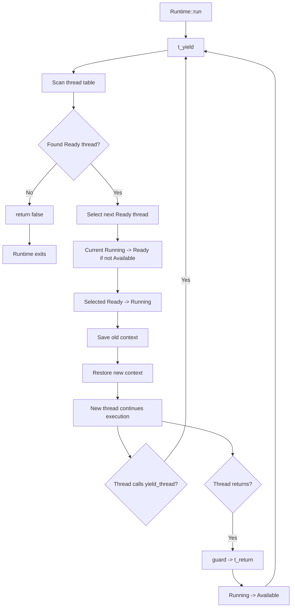

## **200 行绿色线程：执行流动态跟踪分析**

> `trace.log` 已经完整捕获了 200 行绿色线程的核心执行流：spawn 初始化独立栈，线程从 `Available -> Ready -> Running`，通过 `yield_thread()` 主动让出，再由 `switch` 保存/恢复上下文，最终任务结束后回到 `Available`。
>
> **说明**：由于 Linux ASLR（地址空间布局随机化），每次运行时 Runtime 地址和线程栈地址都会不同。本文档中的地址来自某次典型运行，读者实际运行时的地址会不同，但不影响分析结论。

### **实验目标**

本实验针对《Green Threads Explained in 200 Lines of Rust》中的 200 行绿色线程实现进行动态跟踪，目的是观察用户态线程从创建、入队、被调度、主动让出、上下文切换、恢复执行，到最终结束并回收的完整状态变迁过程。

与前两个 Future 示例不同，绿色线程模型并不依赖 `Future::poll`、`Poll::Pending`、`Waker` 或 Reactor。它的执行流切换依赖的是用户态 Runtime 管理的线程表、每个绿色线程独立的栈空间，以及汇编 `switch` 函数对 CPU 上下文的保存与恢复。

本实验重点观察以下执行流闭环：

```text
spawn
  -> Available -> Ready
  -> scheduler selects Ready thread
  -> Ready -> Running
  -> yield_thread
  -> Running -> Ready
  -> context switch
  -> later switched back
  -> continue after yield
  -> task return
  -> Running -> Available
```

### **跟踪点设计**

本次动态跟踪主要覆盖 Runtime 初始化、线程创建、调度器选择、主动让出、上下文切换、任务结束回收等关键位置。

在 Runtime 初始化阶段，跟踪线程表的创建，包括 `thread-0` 主线程以及后续可用的用户态线程槽位。在 `spawn` 阶段，跟踪 Runtime 如何找到 `Available` 线程，为其设置独立栈和初始栈指针，并将状态切换为 `Ready`。在 `t_yield` 阶段，跟踪调度器如何扫描线程表，选择下一个 `Ready` 线程，并更新当前线程和目标线程的状态。在 `yield_thread` 阶段，跟踪绿色线程如何主动让出 CPU。在线程函数返回后，通过 `guard` 和 `t_return` 跟踪线程如何从 `Running` 回收为 `Available`。

需要特别说明的是，本实验没有在裸汇编 `switch` 函数内部插桩。日志只记录 `switch` 调用前和 `switch` 返回后的事件。这是必要的，因为 `switch` 负责保存和恢复寄存器与栈指针，在其中调用 Rust 日志函数可能破坏栈帧、寄存器状态或调用约定。

### **Runtime 初始化与线程表建立**

程序启动后，Runtime 首先初始化线程表：

```text
[0000] runtime: initialization started
[0001] runtime: created base thread id=0, state=Running
[0002] runtime: created thread id=1, state=Available
[0003] runtime: created thread id=2, state=Available
[0004] runtime: created thread id=3, state=Available
[0005] runtime: initialization complete, 4 threads, stack_size=2097152 bytes
[0006] runtime: set global RUNTIME pointer, addr=0x7ffefff233b8
```

这说明 Runtime 中一共维护了 4 个线程槽位。其中 `thread-0` 是基础线程，也就是运行 Runtime 的主执行流，初始状态为 `Running`。`thread-1`、`thread-2` 和 `thread-3` 是可被 `spawn` 使用的绿色线程槽位，初始状态为 `Available`。

每个绿色线程都拥有独立栈空间，日志中显示默认栈大小为：

```text
stack_size=2097152 bytes
```

也就是 2 MB。这一点体现了有栈绿色线程和无栈 Future 的根本区别：绿色线程的执行状态主要保存在自己的栈和寄存器上下文中，而无栈 Future 的执行状态保存在编译器生成的状态机结构体中。

### **spawn 阶段：Available 到 Ready**

随后程序创建两个绿色线程任务：

```text
[0007] runtime: spawn enter
[0008] runtime: spawn found available thread-1
[0009] runtime: spawn thread-1 stack_base=0x7dfd549fe010 stack_size=2097152 initial_rsp=0x7dfd54bfdff0
[0010] runtime: spawn thread-1 Available -> Ready
[0011] runtime: spawn complete
```

以及：

```text
[0012] runtime: spawn enter
[0013] runtime: spawn found available thread-2
[0014] runtime: spawn thread-2 stack_base=0x7dfd547fd010 stack_size=2097152 initial_rsp=0x7dfd549fcff0
[0015] runtime: spawn thread-2 Available -> Ready
[0016] runtime: spawn complete
```

这说明 `spawn` 并没有创建操作系统线程，而是在 Runtime 自己维护的线程表中寻找一个 `Available` 槽位。找到后，Runtime 为该线程准备独立栈，并设置初始 `rsp`，使得该线程第一次被调度时能够从预设的任务入口开始执行。

`spawn` 阶段的状态变化可以概括为：

```text
Available -> Ready
```

其中 `Ready` 表示该绿色线程已经具备运行条件，但尚未被调度器选中执行。

### **第一次调度：主线程切换到 thread-1**

任务创建完成后，Runtime 进入 `run`：

```text
[0017] runtime: run begin, current thread=0
[0018] runtime: calling t_yield, current thread=0
[0019] runtime: t_yield enter, current thread=0
[0020] runtime: scanning for ready threads starting from current=0
[0021] runtime: checking thread-1 state=Ready
[0022] runtime: selected thread-1 (Ready)
```

调度器从当前线程 `thread-0` 之后开始扫描线程表，发现 `thread-1` 处于 `Ready` 状态，于是选择它作为下一个运行线程。

随后发生状态切换：

```text
[0023] runtime: thread-0 Running -> Ready
[0024] runtime: thread-1 Ready -> Running
[0025] runtime: old_pos=0 new_pos=1
[0026] runtime: context switch old=0 new=1
```

这里有一个很重要的细节：`thread-0` 也被 Runtime 当作一个普通执行流管理。它从 `Running` 变回 `Ready`，而 `thread-1` 从 `Ready` 变成 `Running`。随后 Runtime 调用 `switch(old=0, new=1)`，保存 `thread-0` 的上下文，并恢复 `thread-1` 的上下文。

`thread-1` 被切入后开始执行自己的任务函数：

```text
[0027] thread-1: task begin
[0028] thread-1: before yield, counter=0
[0029] yield_thread: called by thread-1
```

这说明 `switch` 并不是普通函数调用意义上的控制流跳转，而是真正改变了当前 CPU 执行上下文，使程序从 `thread-1` 的栈和任务入口继续执行。

### **yield_thread：绿色线程主动让出**

`thread-1` 执行到 `yield_thread()` 后，主动把控制权交还给 Runtime：

```text
[0030] runtime: t_yield enter, current thread=1
[0031] runtime: scanning for ready threads starting from current=1
[0032] runtime: checking thread-2 state=Ready
[0033] runtime: selected thread-2 (Ready)
[0034] runtime: thread-1 Running -> Ready
[0035] runtime: thread-2 Ready -> Running
[0036] runtime: old_pos=1 new_pos=2
[0037] runtime: context switch old=1 new=2
```

这里可以看到绿色线程调度是协作式的。`thread-1` 不会被 Runtime 强制抢占，而是在任务代码主动调用 `yield_thread()` 时才发生切换。

调度器选择了下一个 `Ready` 线程 `thread-2`，于是状态变化为：

```text
thread-1: Running -> Ready
thread-2: Ready -> Running
```

随后调用 `switch(old=1, new=2)`，保存 `thread-1` 的执行上下文，恢复 `thread-2` 的执行上下文。

`thread-2` 开始运行：

```text
[0038] thread-2: task begin
[0039] thread-2: before yield, counter=0
[0040] yield_thread: called by thread-2
```

### **thread-2 让出后切回主线程 thread-0**

`thread-2` 调用 `yield_thread()` 后，Runtime 从 `thread-2` 之后继续扫描：

```text
[0041] runtime: t_yield enter, current thread=2
[0042] runtime: scanning for ready threads starting from current=2
[0043] runtime: checking thread-3 state=Available
[0044] runtime: checking thread-0 state=Ready
[0045] runtime: selected thread-0 (Ready)
```

由于 `thread-3` 仍然是 `Available`，不能被调度运行，Runtime 继续扫描并发现 `thread-0` 是 `Ready`。于是调度器选择 `thread-0`：

```text
[0046] runtime: thread-2 Running -> Ready
[0047] runtime: thread-0 Ready -> Running
[0048] runtime: old_pos=2 new_pos=0
[0049] runtime: context switch old=2 new=0
```

切回 `thread-0` 后，最初在 `[0026]` 调用的 `switch(old=0, new=1)` 终于返回：

```text
[0050] runtime: context switch returned, current=0
[0051] runtime: t_yield returned true, current thread=0
```

这段日志是理解绿色线程的关键。

当 `thread-0` 第一次调用 `switch(old=0, new=1)` 时，它并不会立即返回，而是切换到了 `thread-1`。只有当后续调度再次选择 `thread-0`，恢复了它保存的寄存器和栈指针之后，`thread-0` 才会从当初 `switch` 调用后的那一行继续执行。

因此，`context switch returned` 的含义不是“刚才的函数正常返回”，而是“当前线程被别的线程切出后，又在未来某个时刻被切回来了”。

### **上下文恢复：从 yield 后继续执行**

后续日志清楚展示了绿色线程如何从上一次 `yield_thread()` 之后继续执行。

例如，`thread-1` 在 `[0037]` 被切出后，直到 Runtime 后续再次选择 `thread-1`：

```text
[0053] runtime: t_yield enter, current thread=0
[0054] runtime: scanning for ready threads starting from current=0
[0055] runtime: checking thread-1 state=Ready
[0056] runtime: selected thread-1 (Ready)
[0057] runtime: thread-0 Running -> Ready
[0058] runtime: thread-1 Ready -> Running
[0059] runtime: old_pos=0 new_pos=1
[0060] runtime: context switch old=0 new=1
```

切回 `thread-1` 后，日志显示：

```text
[0061] runtime: context switch returned, current=1
[0062] yield_thread: returned, now running thread-1
[0063] thread-1: after yield, counter=0
[0064] thread-1: before yield, counter=1
```

这说明 `thread-1` 并不是从任务入口重新执行，而是从之前调用 `yield_thread()` 的返回点继续执行。

这正是有栈绿色线程和无栈 Future 的重大差异：

无栈 Future 依赖编译器生成状态机记录执行位置；有栈绿色线程则通过保存和恢复栈指针 `rsp` 以及寄存器上下文，让函数调用栈本身保持暂停时的状态。恢复时，只需要恢复上下文，就能像普通函数调用返回一样继续执行。

### **轮转调度过程**

从日志中可以看出，Runtime 使用的是简单的顺序扫描式 round-robin 调度。整体运行顺序大致为：

```text
thread-0 -> thread-1 -> thread-2 -> thread-0
thread-0 -> thread-1 -> thread-2 -> thread-0
thread-0 -> thread-1 -> thread-2 -> thread-0
```

其中 `thread-3` 始终处于 `Available`，没有任务，因此不会被调度：

```text
[0043] runtime: checking thread-3 state=Available
[0081] runtime: checking thread-3 state=Available
[0119] runtime: checking thread-3 state=Available
[0160] runtime: checking thread-3 state=Available
```

这说明调度器只会选择状态为 `Ready` 的线程。`Available` 表示线程槽位空闲，没有可运行任务；`Running` 表示当前正在运行；`Ready` 表示可以被调度。

### **任务结束与线程回收**

当 `thread-1` 完成循环后，任务函数结束：

```text
[0139] thread-1: after yield, counter=2
[0140] thread-1: task end
[0141] runtime: guard enter, thread finished execution
[0142] runtime: t_return enter, current thread=1
[0143] runtime: thread-1 Running -> Available
```

这段日志说明，绿色线程任务返回后并不是回到普通调用者，而是进入预先设置好的 `guard` 函数。`guard` 调用 `t_return`，将当前线程状态从 `Running` 改为 `Available`，表示该线程槽位可以被后续任务复用。

随后 Runtime 继续寻找下一个可运行线程：

```text
[0144] runtime: t_yield enter, current thread=1
[0145] runtime: scanning for ready threads starting from current=1
[0146] runtime: checking thread-2 state=Ready
[0147] runtime: selected thread-2 (Ready)
[0148] runtime: thread-2 Ready -> Running
[0149] runtime: old_pos=1 new_pos=2
[0150] runtime: context switch old=1 new=2
```

注意这里没有出现：

```text
thread-1 Running -> Ready
```

原因是 `thread-1` 已经在 `[0143]` 被标记为 `Available`。对于已经结束的线程，Runtime 不应该再把它重新放回可运行队列。

`thread-2` 之后也经历了同样的结束流程：

```text
[0153] thread-2: after yield, counter=2
[0154] thread-2: task end
[0155] runtime: guard enter, thread finished execution
[0156] runtime: t_return enter, current thread=2
[0157] runtime: thread-2 Running -> Available
```

至此，两个用户态绿色线程都已经完成并回收。

### **没有 Ready 线程时 Runtime 退出**

最后 Runtime 切回 `thread-0`，继续运行主调度循环：

```text
[0166] runtime: context switch returned, current=0
[0167] runtime: t_yield returned true, current thread=0
[0168] runtime: calling t_yield, current thread=0
[0169] runtime: t_yield enter, current thread=0
[0170] runtime: scanning for ready threads starting from current=0
[0171] runtime: checking thread-1 state=Available
[0172] runtime: checking thread-2 state=Available
[0173] runtime: checking thread-3 state=Available
[0174] runtime: checking thread-0 state=Running
[0175] runtime: no ready thread found, returning false
[0176] runtime: t_yield returned false, current thread=0
[0177] runtime: no ready threads, run end
[0178] runtime: process exit
```

此时 `thread-1`、`thread-2` 和 `thread-3` 都是 `Available`，没有任何 `Ready` 线程。`thread-0` 是当前运行的主线程，状态为 `Running`。调度器扫描一圈后没有找到可调度目标，于是返回 `false`，Runtime 退出。

这说明 Runtime 的终止条件是：

```text
没有任何 Ready 状态的绿色线程
```

而不是所有线程槽位都消失。线程槽位仍然存在，只是都处于空闲或当前运行状态，没有待执行任务。

### **状态迁移总结**

单个绿色线程的生命周期可以表示为：

```text
Available
  -> Ready
  -> Running
  -> Ready
  -> Running
  -> ...
  -> Running
  -> Available
```

其中：

- `Available` 表示线程槽位空闲；
- `Ready` 表示线程已经准备好，可以被调度；
- `Running` 表示线程当前正在 CPU 上执行；
- `Running -> Ready` 发生在主动调用 `yield_thread()` 时；
- `Running -> Available` 发生在线程任务函数执行完成后。

如果从 Runtime 调度器视角看，执行流可以表示为：



### **关键观察结果**

通过本次动态跟踪，可以得到以下结论。

首先，绿色线程的创建不依赖操作系统线程。`spawn` 只是在 Runtime 管理的线程表中寻找一个 `Available` 槽位，并为该槽位设置独立栈和初始执行上下文。

其次，绿色线程是有栈执行流。每个线程拥有自己的栈空间，日志中每个线程的栈大小为 2 MB，并且 `spawn` 阶段会设置初始 `rsp`。这和无栈 Future 依赖状态机保存执行状态的方式不同。

第三，绿色线程调度是协作式的。任务只有主动调用 `yield_thread()` 时才让出执行权，Runtime 才会选择下一个 `Ready` 线程。日志中每次切换都发生在 `yield_thread` 或任务结束后的 `t_return` 路径中，没有出现抢占式切换。

第四，`switch` 的返回语义不同于普通函数调用。一次 `switch(old, new)` 调用会立即切到新线程，只有当旧线程未来被再次调度时，旧线程才会从 `switch` 调用之后继续执行。日志中的 `context switch returned` 正好证明了这一点。

第五，绿色线程恢复执行时不需要显式的 `poll`。恢复是通过还原之前保存的寄存器和栈指针完成的，因此任务可以像普通同步函数一样从 `yield_thread()` 返回后继续运行。

第六，任务函数结束后会进入 `guard`，并通过 `t_return` 将当前线程从 `Running` 变为 `Available`。这使得线程槽位可以被后续任务复用。

第七，Runtime 的退出条件是没有任何 `Ready` 线程。日志末尾显示 `thread-1`、`thread-2`、`thread-3` 都处于 `Available`，`thread-0` 处于 `Running`，因此调度器扫描一圈后返回 `false`，Runtime 结束。

### **与前两个实验的对比**

本实验和前两个 Future / coroutine 实验体现了三种不同的执行流机制。

| 机制                       | 切换触发                        | 状态保存位置                 | 恢复方式                    | 是否独立栈 |
| -------------------------- | ------------------------------- | ---------------------------- | --------------------------- | ---------- |
| 100 行 stackless coroutine | `waiter().await` 返回 `Pending` | Future 状态机                | Executor 再次 `poll`        | 否         |
| 200 行 futures-explained   | Reactor 事件完成后 `wake`       | Future 状态机 + Reactor 状态 | Waker 唤醒后再次 `poll`     | 否         |
| 200 行绿色线程             | `yield_thread()` 或任务返回     | 独立栈 + ThreadContext       | `switch` 恢复寄存器和栈指针 | 是         |

绿色线程模型的最大特点是对业务代码侵入较小。任务函数可以像普通同步代码一样编写，不需要 `async`、`await` 或 `Future::poll`。但代价是 Runtime 必须手动维护线程栈、栈指针、寄存器上下文以及汇编级的切换逻辑，实现复杂度和平台相关性都明显高于无栈 Future。

### **实验结论**

动态跟踪结果表明，200 行绿色线程示例实现的是一种基于用户态 Runtime 的有栈协作式线程调度机制。Runtime 维护一个线程表，每个线程槽位具有 `Available`、`Ready`、`Running` 三种状态。`spawn` 将空闲槽位初始化为可运行线程；`t_yield` 扫描线程表，选择下一个 `Ready` 线程；`switch` 保存当前线程上下文并恢复目标线程上下文；`yield_thread` 是用户态线程主动让出的入口；任务结束后通过 `guard` 和 `t_return` 将线程回收为 `Available`。

该机制与 Rust Future 的无栈状态机路线完全不同。Future 模型通过 `poll` 推进状态机，暂停点由 `await` 表达；绿色线程模型则通过保存和恢复 CPU 上下文与栈指针，在函数调用栈层面直接暂停和恢复执行。前者更轻量、平台无关性更强，也更适合 Rust 当前的 async 生态；后者对业务代码更透明，但需要独立栈和平台相关的上下文切换实现。
