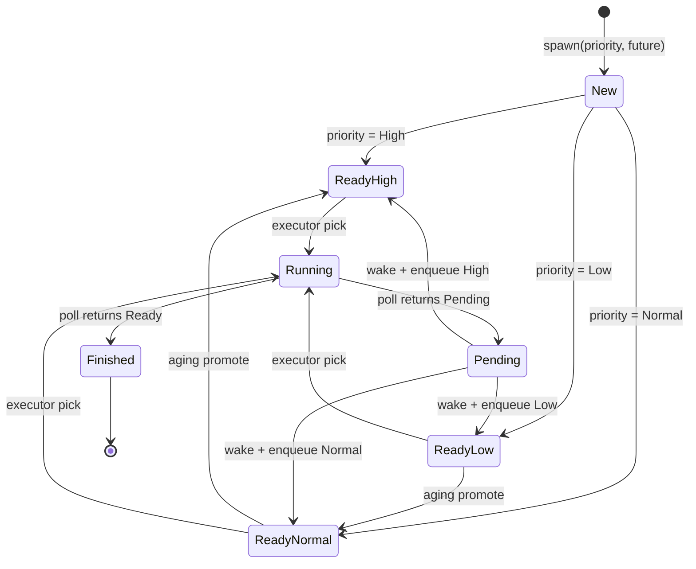
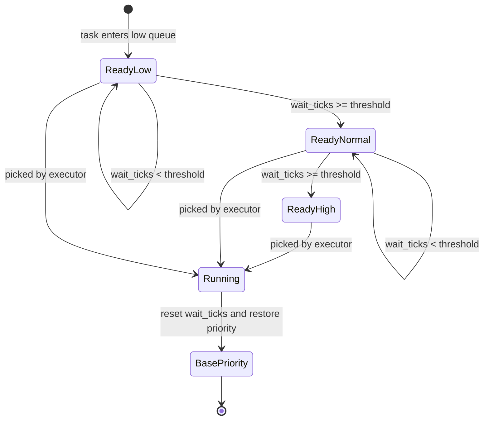

# **Priority Future Executor 设计与实现**

## **1. 背景**

本实验基于 Rust 无栈协程与 `Future` 执行模型展开。前期我已经完成了对原始无栈协程代码的动态跟踪，观察了 `Future` 从创建、被 `poll`、返回 `Pending`、被 `Waker` 唤醒、再次进入执行器并最终完成的状态变迁过程。在此基础上，本阶段进一步尝试为该执行流机制扩展优先级支持，并通过测试验证调度策略的正确性。

相比直接修改绿色线程或 Tokio，本实验选择在一个简化的 Future Executor 上实现优先级调度。原因在于，Future Executor 的调度边界较为清晰：任务通过 `poll()` 被推进，无法继续执行时返回 `Poll::Pending`，外部事件完成后通过 `Waker::wake()` 将任务重新放回 ready queue。这个过程与操作系统中“任务阻塞等待事件、事件完成后被唤醒并重新进入可运行队列”的机制具有较强的结构相似性，因此适合作为调度机制实验的平台。

## **2. 原始无栈协程代码结构**

原始代码主要由 `Future`、`Task`、`Reactor`、`Waker`、`Parker` 和 `block_on` 几个部分组成。它实现了一个最小化的异步执行模型：`Task` 表示一个会等待定时器事件的 Future，`Reactor` 负责管理异步事件，`Waker` 用于在事件完成后唤醒执行器，`block_on` 则不断轮询顶层 Future，直到其完成。

### **2.1 Future**

Rust 中的 `Future` 表示一个可能尚未完成的异步计算。它的核心接口是 `poll()`：

```rust
trait Future {
    type Output;

    fn poll(self: Pin<&mut Self>, cx: &mut Context<'_>) -> Poll<Self::Output>;
}
```

当 `poll()` 返回 `Poll::Ready(value)` 时，表示该 Future 已经完成；当它返回 `Poll::Pending` 时，表示该 Future 暂时无法继续推进，需要等待外部事件完成后再被唤醒。

需要注意的是，`Poll::Ready` 并不是“任务可运行”的意思，而是“Future 已完成”。在 Future Executor 中，“可运行”对应的是任务已经位于 ready queue 中，可以被 executor 再次 `poll`。这一区分对于后续将 Future 模型类比到操作系统任务状态非常重要。

### **2.2 Task**

原始代码中的 `Task` 是一个自定义 Future，用来模拟一个异步定时器任务：

```rust
#[derive(Clone)]
pub struct Task {
    id: usize,
    reactor: Arc<Mutex<Box<Reactor>>>,
    data: u64,
}
```

它的 `poll()` 方法会检查自己是否已经被 `Reactor` 标记为 ready。如果事件尚未完成，`Task` 会把当前 `Waker` 注册到 `Reactor` 中，并返回 `Poll::Pending`。当定时器线程结束后，`Reactor` 会调用对应的 `Waker`，通知执行器这个任务可以继续执行。

因此，`Task` 的生命周期大致是：

```text
第一次 poll
  -> 注册到 Reactor
  -> 返回 Pending
  -> 等待定时器事件

定时器完成
  -> Reactor 调用 waker.wake()
  -> 执行器被唤醒

再次 poll
  -> 发现任务已经 ready
  -> 返回 Ready
```

### **2.3 Reactor**

`Reactor` 是异步事件源的管理者。它维护一个任务状态表，并在独立线程中处理定时器事件：

```rust
struct Reactor {
    dispatcher: Sender<Event>,
    handle: Option<JoinHandle<()>>,
    tasks: HashMap<usize, TaskState>,
}
```

任务第一次被 `poll` 时，会调用 `register()` 注册到 `Reactor`。当定时器线程睡眠结束后，`Reactor` 会调用 `wake(id)`，将对应任务的状态从 `NotReady` 改为 `Ready`，并调用保存的 `Waker`。

```rust
enum TaskState {
    Ready,
    NotReady(Waker),
    Finished,
}
```

这个结构模拟了操作系统或异步 runtime 中常见的事件通知机制。例如真实系统中的 I/O 完成中断、定时器中断、网络事件到达，都可以被抽象为某种 reactor 事件。

### **2.4 Waker**

`Waker` 是 Future 与 Executor 之间的桥梁。Future 在返回 `Poll::Pending` 之前，通常会保存当前 `Context` 中的 `Waker`；当外部事件完成后，事件源通过调用 `waker.wake()` 通知 executor：这个任务现在可能可以继续执行了。

原始代码中的 `MyWaker` 主要负责唤醒 `Parker`：

```rust
#[derive(Clone)]
struct MyWaker {
    parker: Arc<Parker>,
}
```

它的作用是：

```text
异步事件完成
  -> Reactor 调用 waker.wake()
  -> Waker 调用 parker.unpark()
  -> block_on 从 park 中恢复
  -> block_on 再次 poll 顶层 Future
```

这种设计适合单 Future 的 `block_on` 模型，但不适合多任务调度。因为它只能唤醒整个 executor，却不知道“具体是哪一个任务被唤醒”，也无法根据任务优先级将其重新放入不同的 ready queue。

因此，在改造后的 Priority Executor 中，Waker 不再只是简单地 `unpark` 执行器，而是需要携带具体的 `ExecTask` 和 `ExecutorInner` 引用。当任务被唤醒时，Waker 会把对应任务重新放回优先级 ready queue，并唤醒 executor。

### **2.5 block_on**

原始 `block_on` 是一个单 Future 执行器：

```rust
fn block_on<F: Future>(mut future: F) -> F::Output {
    let parker = Arc::new(Parker::default());
    let mywaker = Arc::new(MyWaker {
        parker: parker.clone(),
    });

    let waker = mywaker_into_waker(Arc::into_raw(mywaker));
    let mut cx = Context::from_waker(&waker);

    let mut future = unsafe { Pin::new_unchecked(&mut future) };

    loop {
        match Future::poll(future.as_mut(), &mut cx) {
            Poll::Ready(val) => break val,
            Poll::Pending => parker.park(),
        }
    }
}
```

它的特点是：

```text
只接收一个顶层 Future
只维护一个 Waker
没有任务池
没有 ready queue
没有 spawn 接口
没有调度策略
```

因此，它更适合用来解释 `Future`、`Poll`、`Waker` 和 `Reactor` 的基本协作过程，而不适合作为多任务优先级调度实验的平台。

## **3. 原始实现的局限**

原始主函数中使用了如下结构：

```rust
let mainfut = async {
    fut1.await;
    fut2.await;
};

block_on(mainfut);
```

这段代码看起来包含了两个 Future：`fut1` 和 `fut2`，但从 executor 的角度看，它实际上只驱动了一个顶层 Future：`mainfut`。

`fut1.await; fut2.await;` 的语义是：`mainfut` 会先持续推进 `fut1`，直到 `fut1` 完成后，才继续推进 `fut2`。虽然 `fut2` 这个 Future 值可以在语法上提前构造，但由于 Rust Future 是惰性的，只有被 `poll()` 时才会真正执行。因此，在原始代码中，`fut2` 对应的异步事件不会和 `fut1` 同时注册到 `Reactor`，也就无法体现真正的多任务调度。

原始执行流可以概括为：

```text
poll mainfut
  -> poll fut1
      -> fut1 Pending
  -> mainfut Pending
  -> block_on park

timer for fut1 done
  -> wake mainfut
  -> poll mainfut
      -> fut1 Ready
      -> poll fut2
          -> fut2 Pending
  -> mainfut Pending
  -> block_on park

timer for fut2 done
  -> wake mainfut
  -> poll mainfut
      -> fut2 Ready
      -> mainfut Ready
```

这说明，原始代码中的 `fut1` 和 `fut2` 并不是两个由 executor 独立调度的任务，而是一个顶层 Future 内部的两个顺序 await 点。

为了实现优先级调度，必须将结构改造成：

```rust
executor.spawn(Priority::Low, async move {
    Task::new(reactor.clone(), 1, 1).await;
});

executor.spawn(Priority::High, async move {
    Task::new(reactor.clone(), 1, 2).await;
});

executor.spawn(Priority::Normal, async move {
    Task::new(reactor.clone(), 1, 3).await;
});

executor.run();
```

这样，每个 async block 才是一个独立的顶层任务，executor 才能根据优先级选择先调度哪个任务。

## **4. 为什么选择 Future Executor 扩展优先级**

本实验没有选择直接修改 Tokio、绿色线程或 ArceOS 调度器，而是选择在简化 Future Executor 上扩展优先级，主要有以下原因。

首先，Future Executor 的执行流边界清晰。一个任务从 ready queue 中被取出，经过 `poll()` 推进，如果返回 `Pending`，则等待 Waker 唤醒；如果返回 `Ready`，则任务完成。这条路径短而明确，便于插桩、测试和分析。

其次，绿色线程通常涉及独立栈、寄存器保存恢复、上下文切换和 unsafe 代码。若在绿色线程上直接加入优先级调度，调度策略会与底层上下文切换机制耦合，增加实验复杂度。

再次，Tokio 是成熟的工业级 runtime，内部调度器涉及多线程、work stealing、I/O reactor、任务预算等复杂机制。直接修改 Tokio 不适合作为训练营阶段的小型验证实验。

最后，Future Executor 与操作系统等待队列具有较好的类比关系。Future 中的 `Poll::Pending` 类似任务阻塞等待事件，`Waker::wake()` 类似内核中的唤醒操作，ready queue 则类似可运行任务队列。因此，在 mini executor 中实现 priority-aware wakeup 和 aging，可以为后续分析 ArceOS 的 WaitQueue 或 block I/O 等待路径提供实验基础。

## **5. 改造目标**

本次改造的目标是将原始单 Future `block_on` 模型升级为支持多任务调度的 Priority Future Executor。

具体目标包括：

1. 支持多个顶层 Future，并提供 `spawn(priority, future)` 接口。
2. 为每个任务分配基础优先级。
3. 将原来的单执行流模型改造成 high、normal、low 三个 ready queue。
4. executor 每次调度时优先选择高优先级任务。
5. 同优先级内部保持 FIFO 顺序。
6. 异步事件完成后，Waker 能够将任务重新放回对应优先级队列。
7. 实现 aging 机制，缓解严格优先级导致的低优先级任务饥饿问题。
8. 编写测试验证优先级、FIFO、wake 路径和 aging 机制的正确性。

## **6. 改造前后对比**

| 维度 | 原始实现 | 改造后实现 |
|---|---|---|
| 执行入口 | `block_on(mainfut)` | `PriorityExecutor::run()` |
| 顶层 Future 数量 | 一个 | 多个 |
| 任务创建方式 | 手动组合在 `mainfut` 中 | `spawn(priority, future)` |
| 调度结构 | 无 ready queue | high / normal / low 三队列 |
| 调度策略 | 反复 poll 同一个 Future | 按优先级选择 ready task |
| Waker 作用 | 唤醒 parker | 重新入队指定任务并唤醒 executor |
| 优先级 | 不支持 | High / Normal / Low |
| 防饥饿 | 不支持 | aging |
| 测试方式 | 主要依赖 trace | 自动化测试 + trace |

## **7. 核心结构设计**

### **7.1 Priority**

优先级使用枚举表示：

```rust
#[derive(Clone, Copy, Debug, PartialEq, Eq)]
pub enum Priority {
    Low,
    Normal,
    High,
}
```

三个优先级分别表示低优先级、普通优先级和高优先级。调度器在选择任务时，优先从高优先级队列中取任务；如果高优先级队列为空，再检查普通优先级队列；最后才检查低优先级队列。

### **7.2 ExecTask**

`ExecTask` 是 executor 内部真正调度的任务单元。它包装了一个顶层 Future，并保存任务的优先级、等待 tick、调度次数等元信息。

```rust
pub struct ExecTask {
    pub id: usize,
    pub base_priority: Priority,
    pub current_priority: Mutex<Priority>,
    pub wait_ticks: AtomicUsize,
    pub scheduled_count: AtomicUsize,
    future: Mutex<Option<Pin<Box<dyn Future<Output = ()> + Send>>>>,
}
```

其中：

```text
id：任务唯一标识
base_priority：任务的基础优先级，创建后不变
current_priority：任务当前有效优先级，可被 aging 临时提升
wait_ticks：任务在 ready queue 中等待的 tick 数
scheduled_count：任务被调度的次数
future：被 executor 驱动的异步计算
```

这里区分 `base_priority` 和 `current_priority` 是为了支持 aging。任务可以因为等待过久被临时提升优先级，但被调度一次后，应恢复到基础优先级。这样可以在“高优先级任务优先响应”和“低优先级任务不被永久饿死”之间取得平衡。

### **7.3 ReadyQueues**

ready queue 被拆分成三个队列：

```rust
pub struct ReadyQueues {
    high: VecDeque<Arc<ExecTask>>,
    normal: VecDeque<Arc<ExecTask>>,
    low: VecDeque<Arc<ExecTask>>,
}
```

入队时，根据任务的 `current_priority` 决定加入哪个队列：

```rust
fn enqueue(&mut self, task: Arc<ExecTask>) {
    match task.get_priority() {
        Priority::High => self.high.push_back(task),
        Priority::Normal => self.normal.push_back(task),
        Priority::Low => self.low.push_back(task),
    }
}
```

出队时，严格按照优先级顺序选择：

```rust
fn pop_next(&mut self) -> Option<Arc<ExecTask>> {
    self.high
        .pop_front()
        .or_else(|| self.normal.pop_front())
        .or_else(|| self.low.pop_front())
}
```

这个策略保证了：

```text
High 优先于 Normal
Normal 优先于 Low
同一优先级内部保持 FIFO
```

### **7.4 PriorityExecutor**

`PriorityExecutor` 是对外暴露的执行器结构，负责创建任务、启动调度循环，并维护任务数量。

```rust
pub struct PriorityExecutor {
    pub inner: Arc<ExecutorInner>,
    next_task_id: AtomicUsize,
    current_tick: AtomicUsize,
}
```

它的核心接口是 `spawn()` 和 `run()`。

`spawn()` 负责创建任务，并将任务放入对应优先级队列：

```rust
fn spawn<F>(&self, priority: Priority, future: F) -> Arc<ExecTask>
where
    F: Future<Output = ()> + Send + 'static,
{
    let id = self.next_task_id.fetch_add(1, Ordering::SeqCst);

    let task = Arc::new(ExecTask::new(id, priority, future));

    self.inner.remaining_tasks.fetch_add(1, Ordering::SeqCst);
    self.inner.enqueue(task.clone());

    task
}
```

`run()` 是调度循环。其逻辑可以概括为：

```text
while remaining_tasks > 0:
    if ready queue 中有任务:
        取出最高优先级任务
        创建该任务对应的 Waker
        poll 该任务

        if Poll::Ready:
            标记任务完成
            remaining_tasks -= 1

        if Poll::Pending:
            不立即重新入队
            等待 Waker 后续唤醒

    else:
        park executor，等待 Waker 唤醒
```

一个重要原则是：**任务返回 `Poll::Pending` 后，不应该立即重新入队**。如果立即入队，executor 会不断重复 poll 一个尚未就绪的任务，形成忙等。正确做法是等待外部事件完成后，由 `Waker` 负责重新入队。

### **7.5 ExecutorInner**

`ExecutorInner` 保存 executor 的共享内部状态：

```rust
pub struct ExecutorInner {
    queues: Mutex<ReadyQueues>,
    parker: Arc<Parker>,
    remaining_tasks: AtomicUsize,
    config: ExecutorConfig,
}
```

之所以需要 `ExecutorInner`，是因为 `TaskWaker` 在异步事件完成时也要访问 ready queue，把被唤醒的任务重新加入队列。因此，`TaskWaker` 必须持有 `Arc<ExecutorInner>`。

### **7.6 TaskWaker**

改造后的 Waker 不再只是唤醒 `Parker`，而是要知道“哪个任务被唤醒”，并将该任务重新放回 ready queue。

本实现使用 `futures::task::ArcWake` 来实现 Waker：

```rust
pub struct TaskWaker {
    pub task: Arc<ExecTask>,
    pub executor: Arc<ExecutorInner>,
}

impl ArcWake for TaskWaker {
    fn wake_by_ref(arc_self: &Arc<Self>) {
        let task = arc_self.task.clone();
        let executor = arc_self.executor.clone();

        executor.enqueue(task);
        executor.unpark();
    }
}
```

使用 `ArcWake` 的原因是，它可以避免手写 `RawWaker` 时可能出现的引用计数错误。原始代码中手动实现 `RawWaker`，需要小心处理 `clone`、`wake`、`wake_by_ref` 和 `drop` 的语义；而 `ArcWake` 使用 `Arc` 管理生命周期，代码更安全，也更适合作为实验实现。

`TaskWaker` 的关键作用是保持异步唤醒路径上的优先级信息：

```text
任务第一次被 poll
  -> 返回 Pending
  -> Reactor 保存 Waker

异步事件完成
  -> Reactor 调用 waker.wake()

TaskWaker 被触发
  -> 获取对应 ExecTask
  -> 根据 current_priority 重新入队
  -> unpark executor

executor 恢复
  -> 从 high / normal / low 队列中重新选择任务
```

如果 wake 后不按优先级重新入队，那么优先级机制只在 `spawn` 时有效，而在异步恢复路径上失效。因此，priority-aware Waker 是本实验中最关键的设计点之一。

## **8. 调度流程**

改造后的完整调度流程如下：

```text
spawn(priority, future)
  -> 创建 ExecTask
  -> 根据 priority 入 ready queue

executor.run()
  -> 从 high / normal / low 队列中选择任务
  -> 为该任务创建 TaskWaker
  -> poll future

如果 poll 返回 Ready:
  -> 任务完成
  -> remaining_tasks -= 1

如果 poll 返回 Pending:
  -> 任务暂时离开 ready queue
  -> 等待 Reactor 或其他事件源调用 Waker

Reactor 事件完成:
  -> 调用 waker.wake()

TaskWaker::wake_by_ref()
  -> 将对应任务重新放入 ready queue
  -> unpark executor

executor 继续调度
```

这个流程体现了 Future executor 的核心状态变迁：

```text
Ready -> Running -> Pending -> Ready -> Running -> Finished
```

其中，优先级机制主要作用于两个位置：

```text
spawn 时的首次入队
wake 后的重新入队
```

而 aging 机制作用于：

```text
已经处于 ready queue 中，但尚未被 executor 选中的任务
```

## **9. 状态变迁**

### **9.1 Future 任务生命周期**



在这个状态图中，`ReadyHigh`、`ReadyNormal` 和 `ReadyLow` 表示任务已经处于 executor 的 ready queue 中，可以被调度。它们不同于 `Poll::Ready`。`Poll::Ready` 表示 Future 已经完成，对应图中的 `Finished` 状态。

### **9.2 Aging 状态变化**



Aging 只作用于已经进入 ready queue 的任务。任务在返回 `Poll::Pending` 后，不会立即参与 ready queue aging；只有当外部事件完成，Waker 将其重新放回 ready queue 后，它才开始累计 `wait_ticks`。

这一区分非常重要。它说明本实验中的 aging 是一种 ready queue aging，而不是对所有阻塞任务进行 aging。如果未来将该机制迁移到 ArceOS 的 WaitQueue，则 aging 的作用位置会从 ready queue 扩展到等待队列中，需要重新设计等待时间的统计方式。

## **10. Aging 防饥饿机制**

严格优先级调度虽然可以保证高优先级任务优先运行，但它存在一个明显问题：如果高优先级任务持续进入 ready queue，低优先级任务可能长期得不到调度。这种现象称为 starvation，也就是饥饿。

为缓解这个问题，本实验加入 aging 机制。基本思想是：任务等待时间越长，其动态优先级越高。

每个任务维护：

```rust
base_priority: Priority,
current_priority: Mutex<Priority>,
wait_ticks: AtomicUsize,
scheduled_count: AtomicUsize,
```

其中：

```text
base_priority：任务原始优先级
current_priority：当前实际调度优先级
wait_ticks：任务在 ready queue 中等待的 tick 数
scheduled_count：任务被调度次数
```

Aging 的规则如下：

```text
每轮调度时，对 ready queue 中未被选中的任务增加 wait_ticks

如果 wait_ticks >= aging_threshold:
    Low -> Normal
    Normal -> High
    High 保持不变

任务被 poll 一次后:
    wait_ticks 清零
    current_priority 恢复为 base_priority
```

示例：

```text
Tick 0: low task enters low queue
Tick 1: low task wait_ticks = 1
Tick 2: low task wait_ticks = 2
Tick 3: low task promoted Low -> Normal
Tick 4: low task wait_ticks = 1
Tick 5: low task wait_ticks = 2
Tick 6: low task promoted Normal -> High
Tick 7: low task picked by executor
Tick 8: low task restores to base priority Low
```

这种机制不能消除所有调度问题，但可以防止低优先级任务在严格优先级策略下永久等待。

需要注意的是，aging 主要解决的是**饥饿问题**，不是完整的**优先级反转问题**。优先级反转通常指高优先级任务等待低优先级任务持有的锁，而中优先级任务不断抢占低优先级任务，导致高优先级任务无法继续执行。解决优先级反转通常需要 priority inheritance 或 priority donation。本实验暂未实现这类机制。

## **11. 测试设计**

为了验证优先级机制的正确性，本实验设计了多组测试，覆盖基础优先级调度、同优先级 FIFO、异步唤醒路径和 aging 防饥饿机制。

### **11.1 high_priority_runs_first**

该测试用于验证高优先级任务会先于普通和低优先级任务运行。

测试场景：

```rust
executor.spawn(Priority::Low, async {
    record("low");
});

executor.spawn(Priority::High, async {
    record("high");
});

executor.spawn(Priority::Normal, async {
    record("normal");
});

executor.run();
```

虽然 spawn 顺序是：

```text
Low -> High -> Normal
```

但期望执行顺序是：

```text
High -> Normal -> Low
```

该测试验证调度器不会简单按照任务创建顺序执行，而是会优先选择高优先级 ready queue。

### **11.2 same_priority_fifo**

该测试用于验证同优先级任务内部保持 FIFO 顺序。

测试场景：

```rust
executor.spawn(Priority::Normal, async {
    record(0);
});

executor.spawn(Priority::Normal, async {
    record(1);
});

executor.spawn(Priority::Normal, async {
    record(2);
});

executor.run();
```

期望结果：

```text
0 -> 1 -> 2
```

该测试说明，优先级调度并不意味着完全牺牲公平性。在同一优先级内部，任务仍然按照进入队列的顺序执行。

### **11.3 wake_keeps_priority**

该测试用于验证异步唤醒路径是否保持优先级。

测试场景中，高优先级任务和低优先级任务都会先返回 `Poll::Pending`，随后由 Reactor 或测试 Future 触发 Waker。测试重点不是任务第一次入队时的顺序，而是任务从 Pending 状态被唤醒后，是否仍然按照自身优先级重新进入 ready queue。

期望行为：

```text
High task Pending
Low task Pending

High task wake
Low task wake

High task re-enqueue high queue
Low task re-enqueue low queue

executor picks High before Low
```

该测试非常关键，因为 Future 的核心执行模式并不是一次 poll 到结束，而是反复经历：

```text
poll -> Pending -> wake -> poll
```

如果 wake 路径丢失优先级，那么整个优先级调度机制是不完整的。

### **11.4 pending_then_ready_transition**

该测试用于验证任务可以正确经历 `Pending -> Ready -> Finished` 的状态转换。

测试可以使用一个 `YieldOnce` 或定时器 Future：

```rust
struct YieldOnce {
    yielded: bool,
}
```

第一次 `poll()` 时：

```text
yielded = false
调用 cx.waker().wake_by_ref()
返回 Poll::Pending
```

第二次 `poll()` 时：

```text
yielded = true
返回 Poll::Ready(())
```

该测试可以避免依赖真实时间，使调度器测试更稳定。

### **11.5 strict_priority_can_starve_low**

该测试用于展示严格优先级可能导致低优先级任务饥饿。

测试场景：

```text
关闭 aging
创建多个 High 任务
创建一个 Low 任务
限制 executor 只运行固定 tick 数
观察 Low 任务是否在限定 tick 内被调度
```

期望结果：

```text
High 任务持续运行
Low 任务在限定 tick 内没有运行
```

这个测试不是为了证明调度器“正确”，而是为了展示严格优先级策略的局限性，从而引出 aging 机制的必要性。

### **11.6 aging_prevents_starvation**

该测试在相同场景下开启 aging。

测试场景：

```text
开启 aging
设置 aging_threshold
创建多个 High 任务
创建一个 Low 任务
运行足够 tick
观察 Low 任务是否最终被调度
```

期望结果：

```text
Low 任务等待若干 tick 后被提升到 Normal
继续等待后被提升到 High
最终被 executor 选中运行
```

示例 trace：

```text
aging: task-8 wait_ticks=1
aging: task-8 wait_ticks=2
promote: task-8 Low -> Normal
aging: task-8 wait_ticks=1
aging: task-8 wait_ticks=2
promote: task-8 Normal -> High
executor: pick task-8 current=High base=Low
restore: task-8 High -> base Low
```

这组测试说明，aging 可以在保留优先级倾向的同时，避免低优先级任务永久饥饿。

## **12. 测试结果**

测试运行方式：

```bash
cargo test
```

测试覆盖内容包括：

```text
high_priority_runs_first
same_priority_fifo
wake_keeps_priority
pending_then_ready_transition
strict_priority_can_starve_low
aging_prevents_starvation
wait_ticks_increments_correctly
aging_threshold_affects_promotion_speed
```

示例结果：

```text
running 17 tests
test high_priority_runs_first ... ok
test same_priority_fifo ... ok
test wake_keeps_priority ... ok
test pending_then_ready_transition ... ok
test strict_priority_can_starve_low ... ok
test aging_prevents_starvation ... ok

test result: ok. 17 passed; 0 failed
```

从测试结果可以得到以下结论：

```text
1. 高优先级任务能够优先于普通和低优先级任务运行。
2. 同一优先级内部保持 FIFO 顺序。
3. 任务从 Pending 被 wake 后，仍然按照 current_priority 重新进入对应队列。
4. 严格优先级可能导致低优先级任务饥饿。
5. Aging 可以缓解低优先级任务长期等待的问题。
```

## **13. 关键 Trace 示例**

优先级调度 trace 示例：

```text
[0001] executor: spawn task-1 base=Low current=Low queue=low
[0002] executor: spawn task-2 base=High current=High queue=high
[0003] executor: spawn task-3 base=Normal current=Normal queue=normal

[0004] executor: pick task-2 base=High current=High queue=high
[0005] task-2: poll enter
[0006] task-2: poll returned Pending

[0007] executor: pick task-3 base=Normal current=Normal queue=normal
[0008] task-3: poll enter
[0009] task-3: poll returned Pending

[0010] executor: pick task-1 base=Low current=Low queue=low
[0011] task-1: poll enter
[0012] task-1: poll returned Pending
```

异步唤醒 trace 示例：

```text
[0013] reactor: wake task-2
[0014] waker: enqueue task-2 current=High queue=high
[0015] executor: unpark

[0016] executor: pick task-2 current=High queue=high
[0017] task-2: poll enter
[0018] task-2: poll returned Ready
```

Aging trace 示例：

```text
[0020] aging: task-1 wait_ticks=1 current=Low
[0021] aging: task-1 wait_ticks=2 current=Low
[0022] promote: task-1 Low -> Normal

[0023] aging: task-1 wait_ticks=1 current=Normal
[0024] aging: task-1 wait_ticks=2 current=Normal
[0025] promote: task-1 Normal -> High

[0026] executor: pick task-1 base=Low current=High queue=high
[0027] task-1: poll returned Ready
[0028] restore: task-1 High -> base Low
```

这些 trace 说明，优先级信息贯穿了任务创建、调度、异步唤醒和 aging 的全过程。

## **14. 实验结论**

### **14.1 严格优先级能够保证高优先级任务优先运行**

通过 `high_priority_runs_first` 测试可以看到，即使任务创建顺序是 Low、High、Normal，实际执行顺序仍然是 High、Normal、Low。这说明三队列 ready queue 和 `pop_next()` 策略能够正确实现严格优先级调度。

该机制适合表达“关键任务优先运行”的需求，例如延迟敏感任务、交互式任务或高优先级 I/O 请求。

### **14.2 同优先级 FIFO 保证局部公平性**

通过 `same_priority_fifo` 测试可以看到，同一优先级内部的任务按照进入 ready queue 的顺序运行。这避免了同优先级任务之间的乱序调度，使调度行为更容易推理。

### **14.3 Wake 路径必须保持优先级**

Future 的执行并不是一次性完成的。许多任务都会经历：

```text
Running -> Pending -> wake -> Ready -> Running
```

因此，优先级机制不能只作用于 `spawn()` 时的首次入队，还必须作用于 `Waker::wake()` 后的重新入队。如果 wake 后所有任务都进入同一个普通队列，那么异步恢复路径会丢失任务优先级，导致调度策略不一致。

本实验通过 `TaskWaker` 保存 `ExecTask` 和 `ExecutorInner`，使 Waker 可以在事件完成后将具体任务重新放入对应优先级队列，从而保证了调度策略在异步路径上的完整性。

### **14.4 Aging 可以缓解低优先级任务饥饿**

严格优先级的缺点是可能导致低优先级任务长期等待。通过 `strict_priority_can_starve_low` 测试可以观察到，在高优先级任务持续存在时，低优先级任务可能在限定调度 tick 内完全无法运行。

加入 aging 后，低优先级任务会随着等待时间增加而临时提升优先级。通过 `aging_prevents_starvation` 测试可以看到，低优先级任务最终能够被调度执行。

这说明 aging 可以在优先级和公平性之间提供一个折中：既保留高优先级任务优先运行的特性，又避免低优先级任务永久饥饿。

### **14.5 Aging 不等同于优先级反转处理**

本实验中的 aging 主要处理 starvation，即低优先级任务长期得不到运行的问题。它并不能完整解决 priority inversion。

如果高优先级任务等待低优先级任务持有的锁，而中优先级任务不断抢占低优先级任务，那么即使有 aging，也未必能快速解除高优先级任务的阻塞。此类问题通常需要 priority inheritance 或 priority donation 机制。后续如果在执行器或内核中引入锁依赖关系，可以进一步研究优先级继承机制。

## **15. 与 VegarOS / StarryOS 的关联**

本实验虽然是在用户态 Rust Future Executor 中完成的，但它和 ArceOS / StarryOS 中的等待队列、I/O 唤醒和调度公平性问题具有一定的结构相似性。

### **15.1 Future Executor 与内核执行流的类比**

| Future Executor 概念 | ArceOS / OS 概念 | 含义 |
|---|---|---|
| `ExecTask` | 内核任务 / 用户进程 / 线程 | 被调度的执行实体 |
| ready queue | run queue | 可运行任务集合 |
| `poll()` | 任务被调度执行 | 推进执行流 |
| `Poll::Pending` | 阻塞等待 I/O / 锁 / 事件 | 当前无法继续运行 |
| `Waker::wake()` | `WaitQueue::notify_one()` / I/O completion | 外部事件完成后唤醒任务 |
| `Poll::Ready` | 任务完成 | Future 执行结束 |
| Priority queue | priority-aware run queue / wait queue | 按优先级组织任务 |
| Aging | 等待时间补偿 | 缓解长期等待 |

需要特别注意的是，`Poll::Ready` 对应的是 Future 完成，而不是 OS 中的 `READY` 状态。OS 中的 `READY` 更接近 Future Executor 中“任务已经位于 ready queue 中，可以被再次 poll”的状态。

### **15.2 对 iozone 多进程饥饿问题的启发**

在当前 VegarOS / StarryOS 的 OSComp 测试中，`iozone -t 4` 出现过类似：

```text
Min throughput per process = 0.00 kB/sec
```

的现象。这说明在测试窗口内，至少有一个进程几乎没有获得有效 I/O 前进机会。该问题可能来自多个层面，例如：

```text
VFS 或文件系统层存在粗粒度锁
Ext4 元数据更新路径串行化
block cache 层存在竞争
virtio-blk 请求路径同步等待
WaitQueue 唤醒不公平
scheduler 对 I/O 唤醒任务调度不均衡
```

本实验不能直接证明 ArceOS 的问题一定来自 WaitQueue 或 I/O 唤醒路径，但它提供了一个可迁移的分析视角：如果某些执行流长期等待却得不到唤醒或调度，就可以考虑在等待队列或唤醒路径中加入优先级和等待时间补偿机制。

### **15.3 Priority-aware WaitQueue 迁移设想**

如果后续将本实验的思想迁移到 VegarOS，可以优先从 WaitQueue 或 block I/O 等待路径做局部 PoC，而不是直接修改全局 scheduler。

一个可能的设计是：

```rust
struct PriorityWaitQueue {
    high: VecDeque<TaskRef>,
    normal: VecDeque<TaskRef>,
    low: VecDeque<TaskRef>,
}
```

唤醒时优先选择高优先级队列：

```rust
impl PriorityWaitQueue {
    fn notify_one(&mut self) -> Option<TaskRef> {
        self.high
            .pop_front()
            .or_else(|| self.normal.pop_front())
            .or_else(|| self.low.pop_front())
    }
}
```

进一步地，可以为等待任务记录等待时间：

```rust
struct WaitEntry {
    task: TaskRef,
    base_priority: Priority,
    current_priority: Priority,
    wait_start_tick: usize,
    wait_ticks: usize,
}
```

每次唤醒或调度前，对等待时间过长的任务提升动态优先级：

```rust
fn apply_aging(entries: &mut [WaitEntry], threshold: usize) {
    for entry in entries {
        entry.wait_ticks += 1;

        if entry.wait_ticks >= threshold {
            entry.current_priority = promote(entry.current_priority);
            entry.wait_ticks = 0;
        }
    }
}
```

这种机制不一定提高平均吞吐，但它的目标是改善最小吞吐和等待时间分布，使多个并发 I/O 进程都能获得前进机会。

### **15.4 VegarOS 后续实验计划**

后续可以按以下步骤推进：

```text
第一阶段：只插桩，不改逻辑
  -> 在 syscall read/write、VFS、block I/O、WaitQueue 路径记录 trace

第二阶段：统计等待行为
  -> 记录 pid、wait_start_tick、wake_tick、wait_duration、wake_count

第三阶段：定位是否存在明显不公平
  -> 比较 iozone -t 4 中不同进程的等待时间和唤醒次数

第四阶段：局部引入 priority-aware notify
  -> 优先在 WaitQueue 或 block I/O 等待队列中实现

第五阶段：加入 aging
  -> 等待时间过长的任务获得临时优先级提升

第六阶段：重跑 iozone
  -> 观察 Min throughput per process 是否从 0 改善
  -> 观察各进程 wait_duration 是否更均衡
```

这一路线的优点是改动面较小，不会一开始就影响全局调度器，也不会破坏已有通过的基础测试。

## **16. 局限性与后续工作**

本实验仍然是一个用户态简化模型，与完整操作系统内核仍有差异。

首先，当前 Priority Executor 是单线程 executor，没有实现多核调度、work stealing 或抢占式时间片。因此，它更适合用于理解优先级调度和异步唤醒路径，而不能直接等同于完整 runtime 或内核 scheduler。

其次，当前 aging 作用于 ready queue 中的任务，也就是“已经可运行但尚未被调度”的任务。而 ArceOS 中的 I/O 饥饿可能发生在多个位置，包括 WaitQueue、锁竞争、block request queue、文件系统临界区等。后续迁移时需要先通过 trace 确定瓶颈位置。

再次，本实验没有处理优先级反转问题。如果任务之间存在锁依赖，仅靠 aging 不能保证高优先级任务及时解除阻塞。后续可以考虑实现 priority inheritance。

最后，本实验中的 Reactor 主要模拟定时器事件，而真实内核中的 I/O 完成路径涉及中断、设备队列、DMA、文件系统缓存和锁等更多因素。因此，迁移到 ArceOS 时应从局部等待队列或 block I/O 路径做 PoC，而不是一次性重构整个 I/O 栈。

后续工作可以分为两条线：

```text
用户态实验线：
  -> 完善 trace 可视化
  -> 增加更多调度策略对比
  -> 尝试 priority inheritance

ArceOS 实验线：
  -> 在 I/O 路径加入等待时间 trace
  -> 分析 iozone 多进程等待分布
  -> 实现局部 priority-aware WaitQueue
  -> 对比改造前后的最小吞吐和唤醒公平性
```

## **17. 技术结论**

本实验完成了从单 Future `block_on` 到多任务 Priority Executor 的改造，并在此基础上实现了优先级调度、优先级感知的 Waker 和 aging 防饥饿机制。

从执行流角度看，原始无栈协程代码展示了 `poll / Pending / Waker / Reactor` 的基本状态变迁；改造后的 Priority Executor 则进一步说明，调度策略不仅要作用于任务初次进入 ready queue 的位置，也必须作用于异步任务被唤醒后重新入队的位置。

从调度策略角度看，严格优先级可以保证高优先级任务优先运行，同优先级 FIFO 可以保证局部公平，而 aging 则可以缓解低优先级任务长期等待的问题。

从操作系统关联角度看，Future Executor 中的 `Waker::wake()` 与内核中的 WaitQueue notify 具有相似结构。虽然用户态 executor 不能直接等同于内核调度器，但本实验为后续分析 VegarOS / StarryOS 中的 I/O 饥饿问题提供了一个清晰的小型模型：当多个执行流竞争 I/O 或等待队列资源时，唤醒策略和等待时间补偿机制可能会影响系统的最小吞吐和公平性。

---
