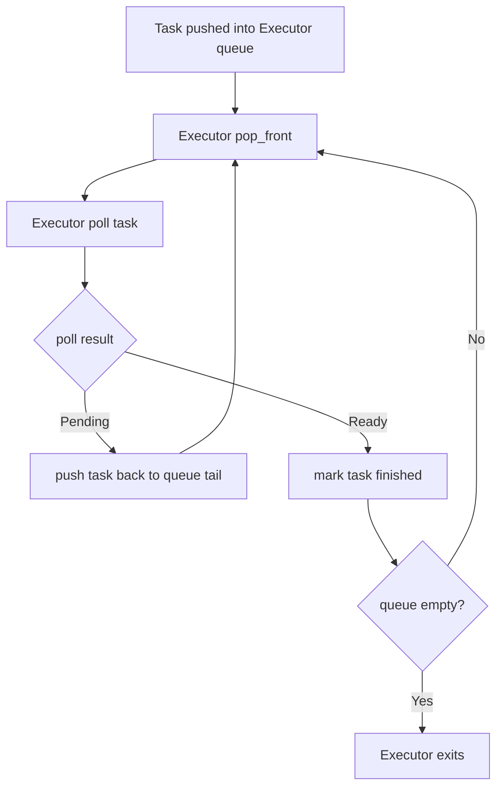

## **A stack-less Rust coroutine library under 100 LoC：执行流动态跟踪分析**

### **实验目标**

本实验针对《A stack-less Rust coroutine library under 100 LoC》中的极简协程执行器进行动态跟踪，目的是观察多个 `async` 任务在 Executor 中的执行流状态变迁过程。

该示例并不是一个完整的异步 I/O 运行时。它没有 reactor，也没有真实的外部事件源；虽然代码中构造了一个 `Waker`，但该 `Waker` 实际上是一个不执行任何操作的 null waker。因此，本实验重点关注的是：在没有真实唤醒机制的情况下，该程序如何仅依靠 `Future::poll`、`Poll::Pending`、`Poll::Ready` 以及 Executor 队列轮转，实现一种极简的协作式调度。

### **跟踪点设计**

为了观察执行流的状态变化，我在原始程序的关键位置加入了递增序号日志。跟踪点主要分为三类。

第一类是 Executor 层跟踪点，用于观察任务何时进入调度队列、何时被取出、何时被 `poll`、何时因为 `Pending` 被重新放回队尾，以及何时因为 `Ready` 被判定为完成。

第二类是 `Waiter::poll` 层跟踪点，用于观察 `Fib` 内部状态在 `Running` 和 `Halted` 之间的切换。这个状态切换是该示例实现协作式让出的核心。

第三类是用户 `async block` 层跟踪点，用于观察业务代码中的 `A`、`B`、`C`、`D` 四个执行点如何在三个任务之间交错出现。

本次实验中创建了三个任务，分别记为 `task-1`、`task-2` 和 `task-3`。每个任务的逻辑结构相同：

```rust
println!("A");
fib.waiter().await;

println!("B");
fib.waiter().await;

println!("C");
fib.waiter().await;

println!("D");
```

因此，每个任务中有三个显式的协作式让出点，分别位于 `A` 与 `B`、`B` 与 `C`、`C` 与 `D` 之间。

### **动态跟踪日志概览**

程序运行后，三个任务首先被依次压入 Executor 队列：

```text
[0001] push task-1
[0002] push task-2
[0003] push task-3
Running
[0004] run begin, queue_len=3
```

这说明任务在创建阶段只是进入就绪队列，并没有立即执行。Rust 的 `Future` 是惰性的，只有当 Executor 主动调用 `poll` 时，任务内部的 `async` 代码才会开始向前推进。

随后，Executor 从队首取出 `task-1` 并进行第一次轮询：

```text
[0005] pop task-1
[0006] poll task-1
[0007] task-1 print A (before await 1)
1 A
[0008] task-1 after print A, await waiter 1
[0009] task-1 state: Running -> Halted, result=Pending
[0010] task-1 Pending -> push_back
```

这段日志展示了单个任务第一次被调度时的完整过程。`task-1` 从 `async block` 的起点开始执行，打印 `A`，随后进入第一个 `fib.waiter().await`。此时 `Waiter::poll` 被调用，发现 `Fib` 的当前状态为 `Running`，于是将状态切换为 `Halted`，并返回 `Poll::Pending`。Executor 收到 `Pending` 后，将 `task-1` 重新放回队尾。

同样的过程随后发生在 `task-2` 和 `task-3` 上：

```text
[0011] pop task-2
[0012] poll task-2
[0013] task-2 print A (before await 1)
2 A
[0014] task-2 after print A, await waiter 1
[0015] task-2 state: Running -> Halted, result=Pending
[0016] task-2 Pending -> push_back

[0017] pop task-3
[0018] poll task-3
[0019] task-3 print A (before await 1)
3 A
[0020] task-3 after print A, await waiter 1
[0021] task-3 state: Running -> Halted, result=Pending
[0022] task-3 Pending -> push_back
```

第一轮调度结束后，三个任务都已经打印了 `A`，并且都在第一个 `await` 处主动让出执行权。此时队列顺序又回到了：

```text
task-1 -> task-2 -> task-3
```

### **任务恢复与 async 状态机推进**

当 `task-1` 第二次被 Executor 取出并轮询时，日志如下：

```text
[0023] pop task-1
[0024] poll task-1
[0025] task-1 state: Halted -> Running, result=Ready
[0026] task-1 resumed after await 1, print B
1 B
[0027] task-1 after print B, await waiter 2
[0028] task-1 state: Running -> Halted, result=Pending
[0029] task-1 Pending -> push_back
```

这段日志是理解该示例的关键。

`task-1` 第二次被 `poll` 时，并没有从 `async block` 的开头重新执行，而是从上一次暂停的 `await` 点继续。此时第一个 `Waiter` 再次被轮询。由于上一次轮询已经将 `Fib` 的状态从 `Running` 改为了 `Halted`，所以这一次 `Waiter::poll` 会将状态从 `Halted` 切换回 `Running`，并返回 `Poll::Ready(())`。

`Poll::Ready(())` 表示第一个 `waiter().await` 已经完成，因此 `async block` 可以继续向后执行，打印 `B`。随后任务进入第二个 `waiter().await`，新的 `Waiter` 再次看到 `Fib` 处于 `Running` 状态，于是返回 `Poll::Pending`，任务再次让出执行权。

这说明该程序中的每个 `waiter().await` 都需要两次 `poll` 才能完成：

```text
第一次 poll：Running -> Halted，返回 Pending，任务让出
第二次 poll：Halted -> Running，返回 Ready，任务恢复
```

这种机制人为构造了一个协作式 yield 点，使得任务可以在多个执行阶段之间交错推进。

### **整体执行顺序分析**

根据完整日志，三个任务的业务输出顺序为：

```text
1 A
2 A
3 A
1 B
2 B
3 B
1 C
2 C
3 C
1 D
2 D
3 D
```

这个顺序说明程序并不是让某一个任务一次性执行完 `A -> B -> C -> D`，而是让每个任务执行到一个 `await` 点后主动让出执行权。Executor 随后按照 FIFO 队列顺序调度下一个任务。

三个任务的执行过程可以抽象为：

```text
task-1: A -> yield -> B -> yield -> C -> yield -> D -> finish
task-2: A -> yield -> B -> yield -> C -> yield -> D -> finish
task-3: A -> yield -> B -> yield -> C -> yield -> D -> finish
```

最终交错形成：

```text
task-1 A
task-2 A
task-3 A
task-1 B
task-2 B
task-3 B
task-1 C
task-2 C
task-3 C
task-1 D
task-2 D
task-3 D
```

因此，该 Executor 的调度策略可以概括为一种简单的 FIFO round-robin 轮转调度。

### **Executor 队列状态变化**

从 Executor 视角看，任务状态主要在 `Queued`、`Running`、`Pending` 和 `Finished` 之间变化。

初始队列为：

```text
[task-1, task-2, task-3]
```

第一轮调度过程如下：

```text
pop task-1 -> task-1 Pending -> push_back -> [task-2, task-3, task-1]
pop task-2 -> task-2 Pending -> push_back -> [task-3, task-1, task-2]
pop task-3 -> task-3 Pending -> push_back -> [task-1, task-2, task-3]
```

第二轮调度时，每个任务先从上一次 `await` 处恢复，打印下一个字母，然后再次进入新的 `waiter().await` 并返回 `Pending`：

```text
pop task-1 -> waiter 1 Ready -> print B -> waiter 2 Pending -> push_back
pop task-2 -> waiter 1 Ready -> print B -> waiter 2 Pending -> push_back
pop task-3 -> waiter 1 Ready -> print B -> waiter 2 Pending -> push_back
```

第三轮类似，任务依次打印 `C` 后再次让出：

```text
pop task-1 -> waiter 2 Ready -> print C -> waiter 3 Pending -> push_back
pop task-2 -> waiter 2 Ready -> print C -> waiter 3 Pending -> push_back
pop task-3 -> waiter 2 Ready -> print C -> waiter 3 Pending -> push_back
```

第四轮中，每个任务的第三个 `waiter().await` 完成后，任务打印 `D` 并结束：

```text
[0065] pop task-1
[0066] poll task-1
[0067] task-1 state: Halted -> Running, result=Ready
[0068] task-1 resumed after await 3, print D
1 D
[0069] task-1 done
[0070] task-1 Ready -> finished
```

`task-2` 和 `task-3` 随后也依次完成：

```text
[0076] task-2 Ready -> finished
[0082] task-3 Ready -> finished
[0083] run end
Done
```

当所有任务都返回 `Poll::Ready(())` 后，Executor 队列为空，执行器退出。

### **执行流状态机**

单个任务的执行流可以概括为以下状态迁移：

```text
Queued
  -> Running
  -> Waiter Pending
  -> Queued
  -> Running
  -> Waiter Ready
  -> Continue
  -> Waiter Pending
  -> Queued
  -> Running
  -> Waiter Ready
  -> Continue
  -> Waiter Pending
  -> Queued
  -> Running
  -> Waiter Ready
  -> Finished
```


从 Executor 的角度，也可以用更简洁的状态图表示：



### **关键观察结果**

通过动态跟踪，可以得到以下结论。

首先，`Future` 是惰性执行的。任务在 `push` 阶段只是被放入 Executor 队列，直到 Executor 调用 `poll`，任务中的 `async` 代码才真正开始执行。

其次，`async/await` 生成的 Future 会保存执行进度。任务在返回 `Poll::Pending` 后并不会丢失上下文；下一次被轮询时，它会从上一次暂停的 `await` 点继续执行。

第三，`Waiter` 是该示例中的协作式让出机制。它第一次被轮询时返回 `Pending`，使当前任务让出执行权；第二次被轮询时返回 `Ready`，使对应的 `await` 表达式完成。

第四，Executor 的调度策略是 FIFO 轮转。任务返回 `Pending` 后被放回队尾，因此多个任务会呈现出 `1A -> 2A -> 3A -> 1B -> 2B -> 3B` 这样的交错执行顺序。

第五，该程序没有真实的事件驱动机制。虽然它构造了 `Waker`，但这个 `Waker` 是 null waker，并不会被外部事件源调用。任务能够继续执行，是因为 Executor 在收到 `Pending` 后主动将任务重新入队，并在之后再次轮询它。

### **实验结论**

《A stack-less Rust coroutine library under 100 LoC》展示的是一种基于 `async/await` 状态机的极简协作式调度机制。它利用编译器生成的无栈 Future 保存任务执行状态，并通过 Executor 的 FIFO 队列反复调用 `poll` 推进任务。

在该实现中，`waiter().await` 并不代表等待真实 I/O 事件，而是一个人为构造的 yield 点。每个 yield 点第一次被轮询时返回 `Pending`，使任务让出执行权；第二次被轮询时返回 `Ready`，使任务从暂停处恢复。

因此，该示例很好地说明了无栈协程的基本执行方式：任务状态保存在 Future 状态机中，Executor 通过 `poll` 驱动任务前进，`Pending` 表示任务暂时无法继续，`Ready` 表示当前等待点或整个任务已经完成。

不过，它并不是一个符合现代 Rust 异步运行时语义的完整 executor。现代异步运行时通常要求在返回 `Poll::Pending` 前注册有效的 `Waker`，并在真实事件到来时由 reactor 或其他事件源调用 `wake`。而该示例没有真实事件源，也没有有效唤醒机制，任务恢复完全依赖 Executor 的持续轮询。因此，它更适合作为理解 `async/await` 状态机和协作式调度的教学示例，而不是可用于真实异步 I/O 的运行时实现。

