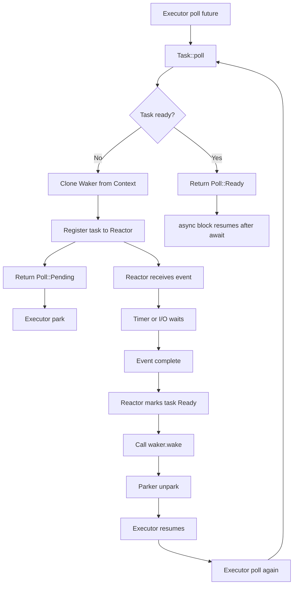
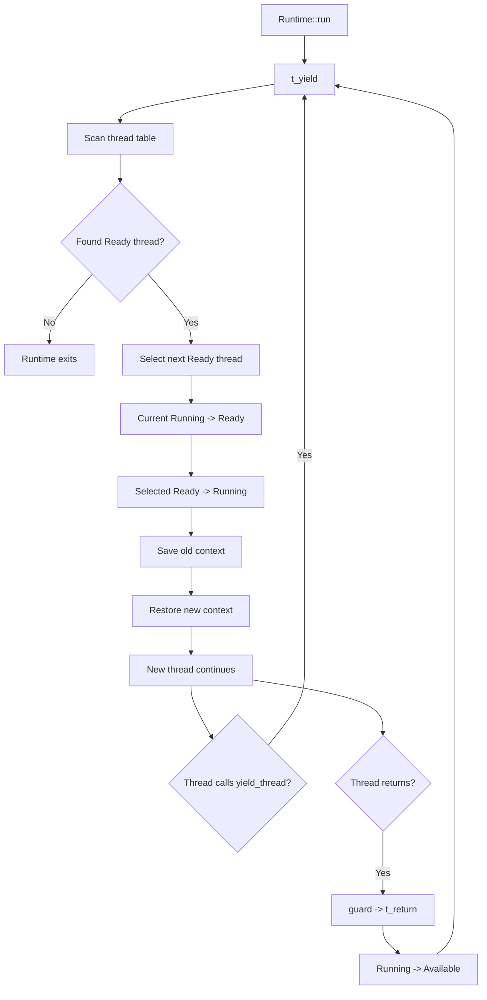
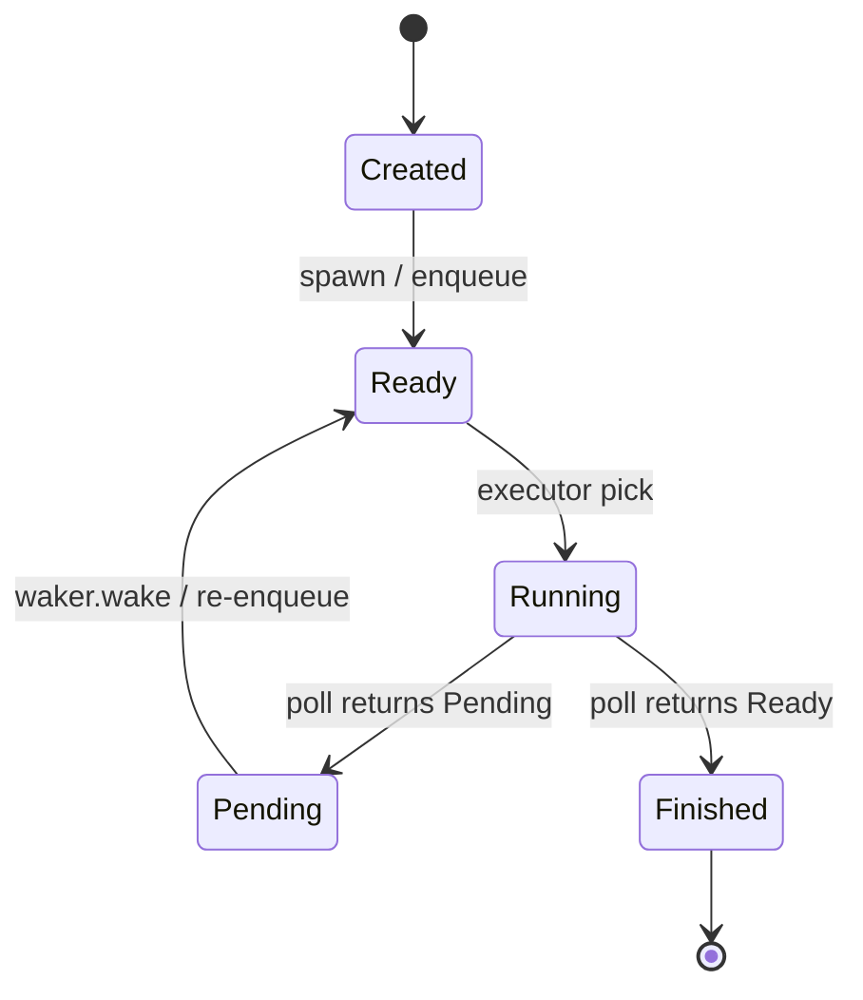
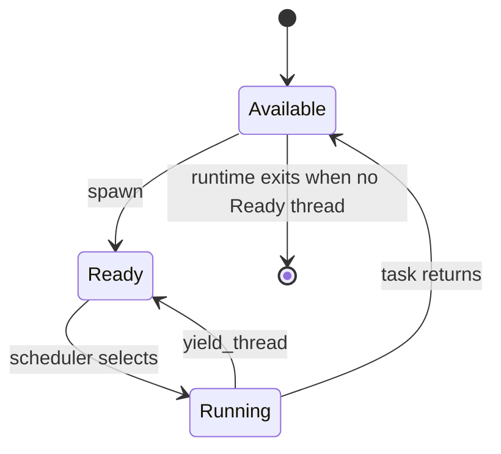

# **执行流机制动态跟踪分析与比较**

## **1. 实验背景**

本阶段围绕用户态执行流机制进行了多组动态跟踪实验，目标是理解不同执行流抽象在创建、调度、挂起、恢复和结束过程中的状态变迁方式。被分析的对象包括三类典型机制：极简无栈协程、带 Reactor/Waker 的 Future 执行器，以及有栈绿色线程。在此基础上，我进一步实现了一个支持优先级调度的 Future Executor，用于验证优先级 ready queue、异步唤醒路径和 aging 防饥饿机制。

本组实验覆盖了以下四个对象：

| 实验对象 | 执行流类型 | 核心机制 | 主要观察点 |
|---|---|---|---|
| 100 LoC stack-less coroutine | 无栈协程 | `poll` + FIFO 轮转 | `Pending` 后立即重新入队 |
| 200 行 futures-explained | 无栈 Future | `poll` + Reactor + Waker | `Pending` 后 park，事件完成后 wake |
| 200 行绿色线程 | 有栈绿色线程 | 独立栈 + 上下文切换 | `yield_thread` 触发 `switch` |
| Priority Future Executor | 优先级 Future 执行器 | 多队列 + priority-aware Waker + aging | 优先级调度和防饥饿 |

这四个实验之间并不是孤立的。它们可以看作执行流机制从“教学级协作式轮转”到“事件驱动 Future”，再到“用户态线程上下文切换”，最后到“调度策略扩展”的递进过程。通过动态跟踪，可以清楚看到：不同机制虽然都能实现“暂停与恢复”，但它们保存状态的位置、恢复执行的触发条件、调度器的职责以及与操作系统内核机制的对应关系都明显不同。

## **2. 100 LoC 无栈协程：基于 Pending 的协作式轮转**

《A stack-less Rust coroutine library under 100 LoC》展示的是一个极简的无栈协程执行器。它没有真实的 Reactor，也没有真正有效的外部事件源。虽然程序中构造了 `Waker`，但该 `Waker` 实际上是 null waker，不会被外部事件调用。因此，该示例的重点不在于现代异步 I/O，而在于展示 `async/await` 状态机如何配合 executor 的队列轮转实现协作式调度。

在该实验中，创建了三个任务 `task-1`、`task-2` 和 `task-3`。每个任务的结构相同：

```rust
println!("A");
fib.waiter().await;

println!("B");
fib.waiter().await;

println!("C");
fib.waiter().await;

println!("D");
```

每个任务有三个显式的协作式让出点，分别位于 `A` 与 `B`、`B` 与 `C`、`C` 与 `D` 之间。动态跟踪显示，任务在创建阶段只是被压入 executor 队列，并不会立即执行。只有当 executor 调用 `poll` 时，任务内部的 async 代码才真正开始推进。这体现了 Rust Future 的惰性执行特征。

第一次调度 `task-1` 时，日志显示：

```text
pop task-1
poll task-1
task-1 print A
task-1 state: Running -> Halted, result=Pending
task-1 Pending -> push_back
```

这说明 `task-1` 被 `poll` 后开始执行，打印 `A`，随后进入第一个 `waiter().await`。`Waiter::poll` 发现内部状态为 `Running`，于是将其切换为 `Halted`，并返回 `Poll::Pending`。Executor 收到 `Pending` 后并不挂起线程，而是直接把任务重新放回队尾。

后续 `task-2` 和 `task-3` 经历相同过程，因此第一轮调度后，三个任务都打印了 `A`，并都在第一个 await 点让出执行权。队列顺序重新回到：

```text
task-1 -> task-2 -> task-3
```

当 `task-1` 第二次被 poll 时，它不会从 async block 的开头重新执行，而是从上一次暂停的 await 点继续。此时第一个 `Waiter` 的状态已经是 `Halted`，因此它会切换回 `Running` 并返回 `Poll::Ready(())`。这使得第一个 `await` 表达式完成，任务继续打印 `B`，然后进入下一个 `waiter().await`，再次返回 `Pending`。

因此，在这个示例中，每个 `waiter().await` 都需要两次 poll 才能完成：

```text
第一次 poll：Running -> Halted，返回 Pending，任务让出
第二次 poll：Halted -> Running，返回 Ready，任务恢复
```

最终三个任务的业务输出顺序为：

```text
1 A
2 A
3 A
1 B
2 B
3 B
1 C
2 C
3 C
1 D
2 D
3 D
```

这说明 executor 使用的是一种简单的 FIFO round-robin 调度策略。每个任务执行到 await 点后主动让出，executor 将其放回队尾，然后继续调度下一个任务。

从执行流状态来看，单个任务的变化可以概括为：

```text
Queued
  -> Running
  -> Waiter Pending
  -> Queued
  -> Running
  -> Waiter Ready
  -> Continue
  -> Waiter Pending
  -> Queued
  -> ...
  -> Finished
```

这个示例的关键意义在于，它清楚展示了无栈 Future 如何保存暂停点。任务返回 `Poll::Pending` 后并不会丢失执行位置；下一次被 poll 时，会从上一次暂停的 await 点继续执行。不过，它并不是现代 Rust async runtime 的完整模型，因为任务恢复并不是由真实事件调用 `Waker` 触发的，而是 executor 在收到 `Pending` 后主动重新入队并持续轮询。这更接近教学意义上的协作式调度，而不是事件驱动的异步 I/O。

## **3. 200 行 Future Executor：Reactor / Waker / Parker 闭环**

《Futures Explained in 200 Lines of Rust》相比 100 LoC 示例更接近现代 Rust async runtime。它引入了 `Reactor`、`Waker` 和 `Parker`，完整展示了一个 Future 从首次被 poll、注册到 reactor、返回 `Pending`、executor 挂起、外部事件完成、waker 唤醒 executor、再次 poll，直到最终返回 `Ready` 的闭环。

该实验重点观察的执行流是：

```text
poll
  -> register waker
  -> Pending
  -> park
  -> reactor event
  -> wake
  -> unpark
  -> poll again
  -> Ready
```

程序启动后，executor 创建 `Parker`、`MyWaker` 和 `Context`，然后开始第一次 poll。此时 `mainfut` 开始执行，并进入 `fut1.await`。进一步 poll 到 `task-1` 时，`task-1` 发现自己尚未注册到 reactor，于是将当前 `Context` 中的 `Waker` 克隆并注册到 `Reactor`，随后返回 `Poll::Pending`。

对应执行流如下：

```text
task-1: poll enter
task-1: first registration to reactor
reactor: register task-1 duration=1s
task-1: returning Poll::Pending
executor: poll returned Pending, preparing to park
Parker::park: waiting on condvar
```

这里和 100 LoC 示例有本质区别。100 LoC 示例中，executor 收到 `Pending` 后会把任务重新放回队尾并继续轮询；而在 200 行 futures-explained 中，executor 收到 `Pending` 后会通过 `Parker::park` 挂起当前线程，等待外部事件完成后再恢复。这避免了无意义的忙轮询，更接近现代异步运行时的事件驱动模型。

随后，Reactor 线程接收到 timeout 事件，并启动 timer 线程模拟外部事件。定时器结束后，Reactor 调用 `wake(1)`，将 `task-1` 的状态从 `NotReady(Waker)` 改为 `Ready`，并调用保存的 `waker.wake()`：

```text
reactor: wake(1) called
reactor: task-1 state NotReady -> Ready
reactor: calling waker.wake() for task-1
mywaker_wake: called
Parker::unpark: calling notify_one
```

这条唤醒链路可以表示为：

```text
timer-thread
  -> reactor.wake(task_id)
  -> TaskState::NotReady -> Ready
  -> waker.wake()
  -> mywaker_wake()
  -> parker.unpark()
  -> condvar.notify_one()
  -> executor resumes from park
```

Executor 被唤醒后，再次 poll `mainfut`。这次 `task-1` 被 poll 时，Reactor 中对应任务已经是 `Ready`，因此 `task-1` 返回 `Poll::Ready`。随后 `fut1.await` 完成，`fut1` 从 await 后继续执行。

该示例还展示了一个重要现象：`fut1.await; fut2.await;` 是顺序 await，不是并发执行。动态跟踪显示，`task-2` 只有在 `fut1` 完成后才第一次被 poll 并注册到 Reactor。因此最终输出时间约为：

```text
task-1 等待 1 秒
task-2 再等待 2 秒
总时间约为 3 秒
```

如果两个任务是真正并发注册到 Reactor，则总耗时应接近 2 秒。这说明创建 Future 不等于执行 Future。Rust Future 是惰性的，只有被 executor poll 时才会真正推进。

从单个 `Task` 的角度看，状态迁移可以概括为：

```text
Created
  -> FirstPoll
  -> RegisterToReactor
  -> NotReady(Waker)
  -> Pending
  -> ReactorEventComplete
  -> Ready
  -> RePoll
  -> Finished
```

从 executor 与 reactor 交互角度看，可以表示为：



该实验的关键结论是：现代 Future 并不是由 Future 自己主动运行，也不是由 executor 无条件反复轮询完成，而是由 executor、future、reactor 和 waker 构成事件驱动闭环。`Waker` 是连接 Reactor 和 Executor 的桥梁。Reactor 不直接执行 Future，也不恢复 async block；它只负责在事件完成后调用 `wake`。真正推动 Future 状态机继续前进的动作仍然是 executor 后续的 `poll`。

## **4. 200 行绿色线程：有栈执行流与上下文切换**

200 行绿色线程示例展示的是另一类执行流机制：有栈用户态线程。它不依赖 `Future::poll`、`Poll::Pending`、`Waker` 或 Reactor，而是由用户态 Runtime 维护线程表、独立栈和 CPU 上下文。执行流切换通过汇编 `switch` 函数保存和恢复寄存器与栈指针完成。

动态跟踪显示，Runtime 初始化时创建了多个线程槽位：

```text
thread-0: Running
thread-1: Available
thread-2: Available
thread-3: Available
```

其中 `thread-0` 是主线程，也是 Runtime 当前运行的基础执行流；其他线程槽位初始为 `Available`，表示空闲。每个绿色线程都有独立栈空间，日志中显示默认栈大小为 2 MB。这是有栈绿色线程与无栈 Future 的根本区别：绿色线程的执行状态主要保存在独立栈和寄存器上下文中，而无栈 Future 的执行状态保存在编译器生成的状态机结构中。

调用 `spawn` 时，Runtime 不创建操作系统线程，而是在自己的线程表中寻找一个 `Available` 槽位，为其设置独立栈和初始栈指针，然后将状态切换为 `Ready`：

```text
spawn found available thread-1
spawn thread-1 Available -> Ready

spawn found available thread-2
spawn thread-2 Available -> Ready
```

随后 Runtime 进入调度循环。调度器扫描线程表，选择下一个 `Ready` 线程，例如从 `thread-0` 切换到 `thread-1`：

```text
thread-0 Running -> Ready
thread-1 Ready -> Running
context switch old=0 new=1
```

此时 Runtime 调用 `switch(old=0, new=1)`。该函数保存 `thread-0` 的寄存器和栈指针，恢复 `thread-1` 的上下文。`thread-1` 被切入后，从预设的任务入口开始执行。

当 `thread-1` 调用 `yield_thread()` 时，它主动让出 CPU。Runtime 再次扫描线程表，选择下一个 `Ready` 线程 `thread-2`：

```text
yield_thread called by thread-1
thread-1 Running -> Ready
thread-2 Ready -> Running
context switch old=1 new=2
```

这说明该绿色线程实现是协作式的。线程不会被 Runtime 强制抢占，只有在任务代码主动调用 `yield_thread()` 或任务函数返回时，才发生调度切换。

绿色线程的恢复语义也与 Future 明显不同。对于 Future 来说，恢复执行依赖 executor 再次调用 `poll`，由编译器生成的状态机跳转到对应 await 后的位置；对于绿色线程来说，恢复执行依赖 `switch` 恢复寄存器和栈指针。被切回的线程会像普通函数调用返回一样，从之前 `yield_thread()` 之后继续运行。

动态跟踪中出现了这样的现象：

```text
context switch old=0 new=1
...
later selected thread-0
context switch returned, current=0
```

这说明 `switch` 的返回语义不同于普通函数调用。当 `thread-0` 第一次调用 `switch(old=0, new=1)` 时，它并不会立即返回，而是切换到 `thread-1`。只有当未来某个时刻调度器重新选择 `thread-0`，恢复其上下文之后，`thread-0` 才会从当初 `switch` 调用后的那一行继续执行。

任务函数结束后，绿色线程不会返回到普通调用者，而是进入预先设置的 `guard` 函数。`guard` 调用 `t_return`，将当前线程状态从 `Running` 改为 `Available`，表示线程槽位可以复用：

```text
thread-1: task end
guard enter
t_return enter
thread-1 Running -> Available
```

单个绿色线程的生命周期可以表示为：

```text
Available
  -> Ready
  -> Running
  -> Ready
  -> Running
  -> ...
  -> Running
  -> Available
```

其中：

```text
Available：线程槽位空闲
Ready：线程已经准备好，可以被调度
Running：线程当前正在执行
Running -> Ready：主动 yield
Running -> Available：任务函数结束
```

从 Runtime 视角看，调度流程为：



绿色线程模型的优势是对业务代码侵入较小。任务可以像普通同步函数一样编写，不需要 `async`、`await` 或手动实现 `Future::poll`。但它的代价也很明显：Runtime 必须维护独立栈、上下文结构、汇编切换逻辑和平台相关细节。相比无栈 Future，它的实现复杂度更高，内存占用也更大。

## **5. Priority Future Executor：优先级调度与异步唤醒路径扩展**

在完成前面三个执行流动态跟踪后，我选择在简化 Future Executor 上扩展优先级调度支持。之所以选择 Future Executor，而不是直接修改绿色线程或 Tokio，是因为 Future Executor 的调度边界更清晰：任务从 ready queue 中被取出，经由 `poll()` 推进；如果返回 `Pending`，则等待 Waker 唤醒；如果返回 `Ready`，则任务完成。这条路径短而明确，便于插桩、测试和验证。

原始 200 行 futures-explained 示例中的 `block_on` 只能驱动一个顶层 Future。即使 `mainfut` 内部包含 `fut1.await; fut2.await;`，从 executor 的角度看，也只是反复 poll 同一个 `mainfut` 状态机。为了实现多任务优先级调度，必须将模型改造成：

```rust
executor.spawn(Priority::Low, async move {
    Task::new(reactor.clone(), 1, 1).await;
});

executor.spawn(Priority::High, async move {
    Task::new(reactor.clone(), 1, 2).await;
});

executor.spawn(Priority::Normal, async move {
    Task::new(reactor.clone(), 1, 3).await;
});

executor.run();
```

改造后的执行器引入了 `ExecTask` 作为真正的调度单元：

```rust
pub struct ExecTask {
    pub id: usize,
    pub base_priority: Priority,
    pub current_priority: Mutex<Priority>,
    pub wait_ticks: AtomicUsize,
    pub scheduled_count: AtomicUsize,
    future: Mutex<Option<Pin<Box<dyn Future<Output = ()> + Send>>>>,
}
```

每个任务有基础优先级 `base_priority` 和当前有效优先级 `current_priority`。区分二者是为了支持 aging：任务可以因为等待过久被临时提升优先级，但被调度一次后恢复到基础优先级。

ready queue 被拆成三个队列：

```rust
pub struct ReadyQueues {
    high: VecDeque<Arc<ExecTask>>,
    normal: VecDeque<Arc<ExecTask>>,
    low: VecDeque<Arc<ExecTask>>,
}
```

任务入队时，根据 `current_priority` 进入对应队列；调度器出队时，优先从 high 队列取任务，如果 high 为空，再取 normal，最后取 low。同一优先级内部使用 FIFO 顺序。

这保证了：

```text
High 优先于 Normal
Normal 优先于 Low
同优先级内部 FIFO
```

本实验中最关键的设计不是 `spawn` 时按优先级入队，而是 wake 路径也必须保持优先级。Future 的执行通常不会一次 poll 到结束，而是会反复经历：

```text
Running -> Pending -> wake -> Ready -> Running
```

如果任务返回 `Poll::Pending` 后，后续被 `Waker` 唤醒时没有按照优先级重新入队，那么优先级机制只在任务创建时有效，而在异步恢复路径上失效。因此，改造后的 `TaskWaker` 不再只是简单地 unpark executor，而是持有具体的 `ExecTask` 和 `ExecutorInner`。当 `Reactor` 调用 `waker.wake()` 时，`TaskWaker` 会把对应任务重新放回优先级 ready queue，并唤醒 executor。

其逻辑为：

```rust
pub struct TaskWaker {
    pub task: Arc<ExecTask>,
    pub executor: Arc<ExecutorInner>,
}

impl ArcWake for TaskWaker {
    fn wake_by_ref(arc_self: &Arc<Self>) {
        let task = arc_self.task.clone();
        let executor = arc_self.executor.clone();

        executor.enqueue(task);
        executor.unpark();
    }
}
```

这样，优先级信息贯穿了：

```text
spawn
  -> enqueue initial priority
  -> pick
  -> poll
  -> Pending
  -> Reactor wake
  -> TaskWaker enqueue current priority
  -> pick again
```

在严格优先级调度基础上，我进一步实现了 aging。严格优先级虽然能保证高优先级任务优先运行，但如果高优先级任务持续进入 ready queue，低优先级任务可能长期无法执行。Aging 的思想是：任务等待时间越长，其动态优先级越高。

规则如下：

```text
每轮调度时，对 ready queue 中未被选中的任务增加 wait_ticks

如果 wait_ticks >= aging_threshold:
    Low -> Normal
    Normal -> High
    High 保持不变

任务被 poll 一次后:
    wait_ticks 清零
    current_priority 恢复为 base_priority
```

该机制主要缓解 starvation，也就是低优先级任务长期得不到运行的问题。它不等同于完整的 priority inversion 解决方案。优先级反转通常涉及锁依赖，需要 priority inheritance 或 priority donation 等机制，本实验暂未实现。

测试结果覆盖了基础优先级、同优先级 FIFO、异步唤醒路径和 aging 防饥饿机制：

```text
high_priority_runs_first
same_priority_fifo
wake_keeps_priority
pending_then_ready_transition
strict_priority_can_starve_low
aging_prevents_starvation
```

其中，`wake_keeps_priority` 是最关键的测试之一。它验证了任务从 `Poll::Pending` 被唤醒后，仍然按照 `current_priority` 重新进入对应 ready queue。`strict_priority_can_starve_low` 展示了严格优先级可能导致低优先级任务饥饿；`aging_prevents_starvation` 则说明 aging 可以使等待过久的低优先级任务最终获得运行机会。

## **6. 四种执行流机制的核心差异**

### **6.1 状态保存位置不同**

四个实验最根本的差异之一，是执行状态保存在什么地方。

| 机制 | 状态保存位置 | 恢复方式 |
|---|---|---|
| 100 LoC 无栈协程 | Future 状态机 | Executor 再次 `poll` |
| 200 行 Future | Future 状态机 + Reactor 状态 | Waker 唤醒后再次 `poll` |
| 绿色线程 | 独立栈 + 寄存器上下文 | `switch` 恢复上下文 |
| Priority Executor | Future 状态机 + 任务元数据 | priority-aware Waker 重新入队后 `poll` |

无栈 Future 的执行状态由编译器生成的状态机保存。每个 `.await` 点都对应状态机中的某个暂停位置。任务返回 `Poll::Pending` 后，下一次被 poll 时可以从该位置继续执行。

绿色线程则完全不同。它有自己的栈和寄存器上下文。任务被切出时，Runtime 保存栈指针和相关寄存器；任务被切回时，Runtime 恢复这些上下文，因此任务可以像普通同步函数一样从 `yield_thread()` 返回后继续运行。

Priority Executor 仍然属于无栈 Future 模型，但额外引入了任务级元数据，包括优先级、等待 tick 和调度次数。这些元数据不属于业务 Future 状态机，而属于 executor 的调度状态。

### **6.2 让出执行权的触发条件不同**

| 机制 | 让出触发点 | 是否主动让出 | 是否依赖外部事件 |
|---|---|---|---|
| 100 LoC 无栈协程 | `waiter().await` 返回 `Pending` | 是 | 否 |
| 200 行 Future | `Task::poll` 注册 Reactor 后返回 `Pending` | 是 | 是 |
| 绿色线程 | `yield_thread()` | 是 | 否 |
| Priority Executor | Future 返回 `Pending` | 是 | 可依赖 Reactor 或测试 Waker |

100 LoC 示例中的 `Pending` 更像人为构造的 yield 点。它不表示真实 I/O 未完成，而只是让 executor 将任务放回队尾，以实现协作式交错执行。

200 行 Future 中的 `Pending` 更接近真实异步语义。任务返回 `Pending` 是因为外部事件尚未完成，并且在返回前已经把 Waker 注册到 Reactor。Executor 不应立即重新 poll，而应等待事件完成后由 Waker 唤醒。

绿色线程中的让出点是显式的 `yield_thread()`。它与 `Future::poll` 无关，而是直接进入 Runtime 调度器，触发上下文切换。

Priority Executor 继承了 Future 模型的 `Pending` 语义，并进一步要求 wake 后重新入队时保持任务优先级。

### **6.3 Executor 的职责不同**

| 机制 | Executor / Runtime 职责 |
|---|---|
| 100 LoC 无栈协程 | 维护 FIFO 队列，反复 poll，Pending 后重新入队 |
| 200 行 Future | poll 顶层 Future，Pending 后 park，等待 Waker 唤醒 |
| 绿色线程 | 管理线程表、栈、上下文，执行 `switch` |
| Priority Executor | 管理多任务 ready queue、优先级、Waker 入队和 aging |

100 LoC executor 的职责最简单：从队首取任务，poll，若 Pending 则放回队尾，若 Ready 则结束。它不关心外部事件，也不依赖有效 Waker。

200 行 Future executor 的职责是驱动一个顶层 Future。当 Future 返回 Pending 后，它挂起当前线程，并等待 Waker 唤醒。这种设计避免了忙轮询，但由于它仍然只驱动一个顶层 Future，因此不具备多任务调度能力。

绿色线程 Runtime 的职责更接近操作系统调度器。它维护线程表，负责选择下一个 Ready 线程，并通过 `switch` 保存和恢复上下文。

Priority Executor 则在 Future executor 的基础上加入了多任务 ready queue。它不仅要管理任务是否 ready，还要根据优先级决定哪个任务先运行，并在异步 wake 路径中保持调度策略一致。

### **6.4 Pending / Blocking / Ready 的含义不同**

在这些实验中，“Pending”“Ready”“Blocked”这些词容易混淆，需要明确区分。

在 Future 语义中：

```text
Poll::Pending：当前 Future 暂时不能继续推进
Poll::Ready(value)：当前 Future 已完成
```

在 executor 调度语义中：

```text
ready queue 中的任务：可以被 executor poll
running task：正在被 executor poll
finished task：Future 返回 Poll::Ready
```

在绿色线程语义中：

```text
Available：线程槽位空闲
Ready：线程可以被调度
Running：线程正在运行
```

因此，`Poll::Ready` 不能简单等同于操作系统中的 `READY` 状态。`Poll::Ready` 表示 Future 完成；而操作系统中的 `READY` 更接近 executor ready queue 中“可以被调度”的任务状态。

## **7. 100 LoC 与 200 行 Future 的对比**

100 LoC stackless coroutine 和 200 行 futures-explained 都是无栈 Future 路线，但它们展示的是两个层次的模型。

| 对比项 | 100 LoC stackless coroutine | 200 行 futures-explained |
|---|---|---|
| `Pending` 后行为 | 立即重新入队 | executor park |
| 是否有有效 Waker | 否，null waker | 是 |
| 是否有 Reactor | 否 | 是 |
| 恢复原因 | executor 主动再次 poll | 事件完成后 wake |
| 调度方式 | FIFO 轮转 | 单 Future park/unpark |
| 更接近真实 async runtime | 较弱 | 较强 |

100 LoC 示例更适合理解 `async/await` 状态机和协作式轮转。它展示了 Future 如何保存执行位置，以及多个任务如何通过 `Pending -> push_back` 形成交错执行。

200 行 Future 示例更适合理解现代 async runtime 的核心闭环。它展示了 Future 如何注册 Waker，Executor 如何在 Pending 后挂起，Reactor 如何在事件完成后调用 wake，以及 Executor 如何再次 poll Future。

二者的关键差异在于：100 LoC 示例中的任务恢复来自 executor 的主动轮询，而 200 行 Future 示例中的任务恢复来自外部事件触发的 Waker。

## **8. Future 与绿色线程的对比**

Future 和绿色线程都能实现“暂停与恢复”，但它们的实现路线完全不同。

| 对比项 | 无栈 Future | 有栈绿色线程 |
|---|---|---|
| 状态保存 | 编译器生成状态机 | 独立栈 + 寄存器 |
| 暂停点 | `.await` | `yield_thread()` 或阻塞点 |
| 恢复方式 | executor 再次 `poll` | 恢复上下文并继续执行 |
| 栈 | 无独立任务栈 | 每个线程有独立栈 |
| 实现复杂度 | 较低，平台无关性强 | 较高，依赖上下文切换 |
| 业务代码形式 | `async/await` | 普通同步函数 |

Future 的优点是轻量。每个 Future 不需要独立栈，暂停状态由状态机结构保存。它和 Rust 的所有权、生命周期、类型系统结合得更自然，也更符合当前 Rust async 生态。

绿色线程的优点是对业务代码透明。任务可以像普通同步函数一样写，不需要显式 `async` 或 `await`。但它需要每个线程独立栈，并且需要保存和恢复平台相关的 CPU 上下文，Runtime 实现成本更高。

动态跟踪中可以清楚看到这种差异：Future 恢复时会再次进入 `poll`，由状态机决定从哪个 await 点继续；绿色线程恢复时则从 `switch` 返回后继续，表现得像普通函数调用从暂停处返回。

## **9. Priority Executor 相对前三个实验的扩展意义**

Priority Executor 并不是一种全新的执行流类型，而是在 200 行 Future executor 的基础上扩展了调度策略。它保留了 Future 的基本语义：

```text
poll
  -> Pending
  -> wake
  -> poll again
  -> Ready
```

但它将单 Future 驱动模型扩展为多任务调度模型，并引入了：

```text
多 ready queue
任务优先级
priority-aware Waker
aging 防饥饿
```

这使得实验从“理解执行流状态变迁”进一步推进到“修改调度策略并验证正确性”。在这个执行器中，调度策略不仅作用于任务首次 spawn 时，也必须作用于异步 wake 后重新入队时。

这点非常重要。因为在真实异步系统中，任务往往不是一次 poll 就完成，而是多次经历 Pending 和 wake。如果 wake 路径不保留优先级信息，那么调度策略是不完整的。

Priority Executor 的完整路径可以表示为：

```text
spawn(priority, future)
  -> enqueue by priority

executor pick highest priority task
  -> poll

if Pending:
  -> task leaves ready queue
  -> waits for event

event completes:
  -> Waker wakes task
  -> enqueue by current_priority

executor picks again
  -> poll

if Ready:
  -> task finished
```

Aging 的加入则进一步说明：调度策略不能只考虑优先级，还必须考虑公平性。严格优先级可以保证高优先级任务优先响应，但也可能让低优先级任务长期无法运行。Aging 通过等待时间提升动态优先级，使低优先级任务最终获得运行机会。

## **10. 执行流状态机的统一视角**

尽管四个实验机制不同，但它们都可以抽象为“执行流在若干状态之间迁移”的过程。

对于无栈 Future，可以抽象为：

```text
Created
  -> ReadyQueue
  -> Running
  -> Pending
  -> ReadyQueue
  -> Running
  -> Finished
```

对于带 Reactor 的 Future，可以抽象为：

```text
Created
  -> Running
  -> RegisterWaker
  -> Pending
  -> WaitingEvent
  -> Woken
  -> Running
  -> Finished
```

对于绿色线程，可以抽象为：

```text
Available
  -> Ready
  -> Running
  -> Ready
  -> Running
  -> Available
```

对于 Priority Executor，可以抽象为：

```text
Created
  -> ReadyHigh / ReadyNormal / ReadyLow
  -> Running
  -> Pending
  -> Woken
  -> ReadyHigh / ReadyNormal / ReadyLow
  -> Running
  -> Finished
```

其中，Priority Executor 相比普通 Future executor 多了两个维度：

```text
ready 状态被细分为不同优先级队列
ready 状态中的任务会因 aging 动态改变优先级
```

可以用如下图表示统一的 Future 执行流：



Priority Executor 则是在 `Ready` 状态内部进一步划分：

```mermaid
stateDiagram-v2
    [*] --> New

    New --> ReadyLow: spawn Low
    New --> ReadyNormal: spawn Normal
    New --> ReadyHigh: spawn High

    ReadyLow --> ReadyNormal: aging promote
    ReadyNormal --> ReadyHigh: aging promote

    ReadyHigh --> Running: pick high first
    ReadyNormal --> Running: pick when no high
    ReadyLow --> Running: pick when no high/normal

    Running --> Pending: Poll::Pending
    Pending --> ReadyHigh: wake + enqueue High
    Pending --> ReadyNormal: wake + enqueue Normal
    Pending --> ReadyLow: wake + enqueue Low

    Running --> Finished: Poll::Ready
    Finished --> [*]
```

绿色线程的统一状态图则是：



这些图说明，不同执行流机制的核心差别并不在于是否能暂停和恢复，而在于：

```text
暂停状态保存在哪里
谁决定何时恢复
恢复时通过什么机制进入执行
调度器是否能改变执行顺序
```

## **11. 与操作系统调度的关系**

这组实验虽然运行在用户态 Rust 程序中，但它们和操作系统调度机制具有明显的对应关系。

| 用户态实验概念 | 操作系统概念 | 说明 |
|---|---|---|
| Future task / ExecTask | 进程 / 线程 / 内核任务 | 被调度的执行实体 |
| ready queue | run queue | 可运行任务集合 |
| `poll()` | 被调度执行 | 执行流向前推进 |
| `Poll::Pending` | 阻塞等待事件 | 等待 I/O、锁或定时器 |
| `Waker::wake()` | wakeup / notify | 外部事件完成后唤醒 |
| Reactor | I/O 子系统 / 中断处理 | 管理外部事件 |
| Parker | 阻塞当前执行线程 | 避免忙等 |
| green thread switch | 上下文切换 | 保存和恢复执行上下文 |
| aging | 等待时间补偿 | 缓解饥饿 |

需要注意的是，这些对应关系是结构类比，不是完全等价。Future Executor 中的 `Poll::Ready` 表示 Future 完成，而不是 OS 中的 runnable 状态。OS 中的 ready/runnable 更接近 Future Executor 中“任务位于 ready queue 中，可以被 poll”的状态。

这组实验对 ArceOS / StarryOS 的启发主要体现在等待队列和 I/O 唤醒路径上。在 `iozone -t 4` 这类多进程 I/O 测试中，如果出现某些进程最小吞吐为 0 的情况，说明可能存在某些执行流长期没有获得 I/O 前进机会。原因可能包括 VFS 大锁、文件系统元数据路径串行化、block cache 竞争、virtio-blk 同步等待、WaitQueue 唤醒不公平或 scheduler 对 I/O 唤醒任务调度不均衡。

Priority Executor 的实验不能直接证明内核瓶颈所在，但它提供了一个分析视角：如果多个执行流都在等待某种资源，那么唤醒策略、ready queue 组织方式和等待时间补偿机制都会影响最终的公平性。后续可以在 ArceOS 的 syscall、VFS、block I/O 或 WaitQueue 路径中加入 trace，记录：

```text
pid
wait_start_tick
wake_tick
wait_duration
wake_count
I/O operation type
block number
```

如果发现某些进程等待时间明显更长或唤醒次数明显更少，就可以尝试局部引入 priority-aware notify 或 aging 机制，观察最小吞吐和等待时间分布是否改善。

## **12. 四个实验得到的关键认识**

通过对这四个执行流机制的动态跟踪，可以得到几个比较重要的认识。

第一，Rust Future 是惰性执行的。无论是 100 LoC 示例还是 200 行 futures-explained，任务在被创建时都不会立即运行，只有 executor 调用 `poll` 后，async 代码才真正向前推进。这一点解释了为什么 `fut1.await; fut2.await;` 是顺序等待，而不是自动并发执行。

第二，`Poll::Pending` 的含义依赖于 executor 设计。在 100 LoC 示例中，`Pending` 更像协作式 yield，executor 会主动把任务重新入队；在 200 行 Future 示例中，`Pending` 表示真实等待外部事件，executor 会 park，直到 Waker 被调用。

第三，`Waker` 是现代 Rust async 的关键桥梁。Future 返回 Pending 前必须保存 Waker，Reactor 在事件完成后调用 wake，而 executor 再次 poll 才真正恢复 Future。Reactor 不直接执行 Future，Waker 也不直接运行 Future，它只是通知 executor 任务可以继续推进。

第四，绿色线程和 Future 的暂停恢复机制完全不同。Future 依赖状态机和 poll 恢复；绿色线程依赖独立栈和上下文切换恢复。前者轻量、平台无关性强；后者对同步代码更透明，但实现复杂度更高。

第五，调度策略必须覆盖唤醒路径。Priority Executor 的实验说明，如果只在 spawn 时按优先级入队，而 wake 后丢失优先级，那么异步任务恢复时调度策略会失效。因此，priority-aware Waker 是优先级 Future Executor 的关键部分。

第六，严格优先级需要配合公平性机制。严格优先级可以保证高优先级任务优先运行，但也可能导致低优先级任务饥饿。Aging 通过等待时间提升动态优先级，可以在优先级和公平性之间取得折中。

第七，用户态执行流实验可以为内核调度和 I/O 等待路径提供原型模型。虽然 Future Executor 不能直接等同于内核 scheduler，但 `Pending -> wake -> ready queue` 与内核中的 `block -> wakeup -> run queue` 具有相似结构，因此可以用于指导 ArceOS / StarryOS 中 WaitQueue 和 I/O 唤醒公平性的后续分析。

## **13. 后续工作方向**

基于本阶段的动态跟踪和 Priority Executor 实验，后续工作可以沿两个方向展开。

用户态实验方向上，可以继续完善 Priority Executor，例如增加更细粒度的 trace 可视化，比较 FIFO、严格优先级、aging、round-robin 等不同调度策略的行为差异。还可以进一步研究 priority inheritance，用于处理 aging 无法解决的优先级反转问题。

内核实验方向上，可以先不急于重构 ArceOS / StarryOS 的全局调度器，而是在 I/O 路径中做局部插桩。可以从 syscall read/write、VFS、block cache、virtio-blk 和 WaitQueue 路径开始，统计不同进程的等待时间和唤醒次数。如果确认存在明显不公平，再尝试在局部 WaitQueue 或 block I/O 请求队列中实现 priority-aware notify 和 aging。

这样的路线风险较小，也能保持和本阶段用户态实验的一致性：先通过动态跟踪理解执行流状态，再针对具体瓶颈修改调度或唤醒策略，最后通过测试验证机制是否改善了公平性。